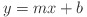
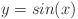
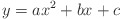
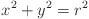

# Class-Instructions

Instructions for each checkpoint/deliverable in this class, as well as helpful setup/configuration instructions. Below are the design parameters for your XY Plotter, as well as some rules for the class.

## Project Specifications

Your objective this semester is to take an existing XY Plotter, deconstruct it, and reimplement it (along with some additional functionality) using a Raspberry Pi 4 and it's necessary accompanying hardware. 

As covered later, you'll be using Python to program, and two Raspberry Pi "Hats" which add Stepper Motor control for the X and Y stepper motors, and an LCD display. In addition to the hats, you'll also be using two digital encoders for input/controls and an H-Bridge chip to drive the Z axis stepper motor.

In addition to recreating the functionality of the original XY Plotter (X, Y, Z axis control) you will also be implementing three "Operating Modes" and an interactive menu system on the LCD display to select them as well as other operations such as calibration, homing, etc. These "Operating Modes" include an Equation Drawer, an Etch-A-Sketch mode, and a G-Code mode, parameter for which exist below.

### Etch-A-Sketch

For the Etch-A-Sketch mode, your goal is fairly simple: recreate the functionality of the popular kids toy! You'll use the two digital encoders provided to control the X and Y axis to create a "manual" drawing mode.

- When spinning the encoder knobs clockwise, the X-axis should move "right" relative to its home position and the Y-axis should move "up" relative to its home position. Conversely, when spinning the encoder knobs counter-clockwise, the X-axis should move "left" relative to its home, and the Y-axis should move "down" relative to its home.

- The mode should include the ability to adjust any necessary parameters such as motor step size, speed, etc. The LCD display has 5 GPIO buttons that can be used for this purpose.

- The mode should also include the ability to toggle the Z-axis (the pen holder) in an "up" and "down" position.The digital encoders come with extra GPIO output for a "short" and "long" press that could be used here.

- For your safety as well as the safety of the equipment, you should make sure the motors stop when encountering the X and Y endstop switches and when it has reached the opposite end of its gantry. In essence, make sure the motors do not attempt to go where they can't.

### Equation Drawer

For the Equation Plotter mode, you will design an algorithm to plot several given functions. This functions will be provided ahead of time and can be ‘hard-coded’ into a Python script to be run. 

A letter sized sheet of paper (8.5” x 11”) will be placed on the dotted lines on the plotter platform. The origin will be roughly the center of the sheet of paper. The axes will extend 8 cm in each direction, both positive and negative.  Simple ‘graph’ paper with this scale is available for download and printing [here](./resources/equation_plotter_graph_paper.pdf).

You will be expected to graph the following functions:

where the constants: `m`, `b`, `a`, `c`, and `r` will be given as input to your program.

### G-Code (TODO)

<!---
TODO:

Identify subset of G-Code needed for the XY Plotter:

    * Complexity of the instruction set should be dictated by the needs of the equation drawer and the instructions needed for our sample G-Code input.
--->

### LCD/Encoder Interface

Finally, you should create a User Interface using the provided 2x16 LCD display and digital encoders. The interface should provide access to and facilitate the use of each of the operating modes, as well as provide and accept any other configuration information or calibration options/operations.

Use the [interface on the Prusa i3 3D printer](https://help.prusa3d.com/en/article/lcd-menu-original-prusa-i3_142322) as inspiration.

### Documentation Expectations

Throughout the project, you will need to thoroughly document what you did, how you did it, and how someone with no prior knowledge of the project could recreate it (you can assume this hypothetical person has the same knowledge you had at the beginning of the course). Essentially you are documenting what your plotter does, and then how you specifically and uniquely implemented the required functionality. This documentation should require thorough explanations as well as any diagrams, pictures, code, or other data you created or used for that deliverable. To create/collect this documentation, you are free to use whatever tools you and your team desire, but to earn extra credit you can create a [Github Pages](https://pages.github.com/) website in your team repository and keep/update your documentation from there! While not required upon submission of your deliverables each week, you should update/add to this documentation as you work on it, as you'll be collecting, formatting, and submitting it at the end of the semester as part of your final deliverable.

## Project Rules

Below is a set of rules to follow while working on this project in addition to any established on the syllabus. These are generally best practices for keeping your project organized and on track.

### Breadboard Wiring

When wiring up components with a breadboard it is crucial that your wires stay organized and distinguishable. If you don’t follow these practices, you’re likely to screw up the wiring for your XY Plotter often, which not only leads to frustration and wasted time, but could also be fatal for your more sensitive components such as the H-Bridge chip or the Raspberry Pi. If you follow these steps, you will be well on your way to avoiding the most common pitfalls:

1. ### Use Clean Wiring

    

    Keep your wiring clean. Avoid excessively long wires which make it impossible to trace if there is a problem and are more prone to pull out. You can either purchase wires that are pre-cut to different lengths or make them yourself.

2. ### Use Color Coding

    

    Another tip is to organize your wires so that the color matches the circuit's electrical property. This will help you identify what types of wires are which when troubleshooting your breadboard circuits. The most common wire color coding is that all POWER wires should be RED, and all GROUND wires should be BLACK.

    As you get more advanced, you can have different colors representing different voltage levels and functions. For example you can add a separate color for digital signals with 5V logic, and another for 3.3V.

    For analog circuits, you may want to have a specific color for an amplifier input or output, and yet another color to identify an ADC input.

    Besides organization, this will really help you spot mis-wirings before you apply power and potentially damage your hardware. Keep a careful lookout for RED and BLACK wires connecting to the same terminal strip, as this could indicate a short.

### Cases/Housings

To encourage a more 'clean' look and feel to your final plotter, we are giving extra credit for teams who design and manifacture a custom case for their Raspberry Pi and other hardware. The case can be manufactured using anything found in the Fabrication Lab (Remember, there are other ways to rapidly manufacture than 3D printing!) such as the wood/acrylic laser cutter, waterjet cutter, 3D printers, and much more. Some additional parameters for the case are given below. These parameters must be met to earn extra credit:

- The case must hold the Raspberry Pi as well as the additional hardware used (hats, encoders, breadboards, etc.) with the only hardware outside of the case being the Plotter itself, the power supply, and wiring.
- You should aim to make the case compact, with a maximum size of 8" on each side.
- Your wiring out of the case should be clean, meaning nearly all wires exit the case in only 1-2 spots.
- You must take cooling for the Raspberry Pi, Adafruit Motor Hat, and H-Bridge chip into consideration as ventillation holes are mandatory and use of fans and heatsinks are strongly suggested (This could also give you a performance advantage).
- User Interface devices (encoders, LCD, etc.) for your plotter should be clearly visible and easy to use.
- In general, the custom case should be an improvement on the provided one in terms of cleanliness, easy of use, and protection/support of your sensitive components.

To get you started, here are some existing designs for Raspberry Pi cases on [Thingiverse](https://www.thingiverse.com/search?q=raspberry+pi+4+case&type=things&sort=relevant).

### Code Style/Conventions

Your code should follow the commonly accepted code style conventions outlined in [PEP 8](https://www.python.org/dev/peps/pep-0008/) on the official Python website. In addition to the practices outlined in PEP 8, you should follow [Object-Oriented Programming](https://en.wikipedia.org/wiki/Object-oriented_programming) principles when necessary (we'll generally let you know if something needs to be a class) and avoid creating [monolithic](https://en.wikipedia.org/wiki/Monolithic_application) software; instead opt to break your software into smaller, more manageable and maintainable pieces.

### Maintaining your Group Github Repository

In order to encourage you to learn the useful skill of managing and using a Git/Github repository, we ask to keep your group repository up to date, follow the [Github Flow](https://guides.github.com/introduction/flow/) and to use Git/Github's features like [issues](https://guides.github.com/features/issues/) to your advantage! More information on Git/Github and how to learn it will be provided in the deliverable instructions.

### Collaboration Policy (policy attribution: from ECE4750 Cornell)

The work you submit in this course is expected to be the result of your individual effort only, or in the case of weekly deliverables, the result of you and your group’s effort only. Your work should accurately demonstrate your understanding of the material.

You are encouraged to study together and to discuss information and concepts covered in lecture
with other students. You can give “consulting” help to or receive “consulting” help from other students. Students can also freely discuss basic computing skills or the course infrastructure. However, this permissible cooperation should never involve one student (or group) having possession of or observing in detail a copy of all or part of work done by someone else, in the form of an email, an email attachment file, a flash drive, a hard copy, on a computer screen, or in any other manner. Students are not allowed to seek consulting help from online forums outside of UGA (i.e. having someone on reddit do your project for you).

Students are encouraged to seek consulting help from their peers and from the course staff via office hours and various discussion forums (Groupme, ELC, Github, etc…) . If a student receives consulting help from anyone outside of the course staff, then the student must acknowledge this help on the submitted assignment.

**Examples of acceptable collaboration:**

- Bob is struggling on a problem set about processor pipelining, so he seeks consulting help from
Alice, a fellow student in the course. Alice goes through various examples from the lecture and
reading materials to help Bob understand the concepts, and they sketch a few pipeline diagrams
related to the problem solution together on a whiteboard. Bob and Alice work independently to
flesh out the details of the problem solution and they each write up their work independently.
Bob acknowledges the help he received from Alice on his submission.

- Bob, Ben, and Beth are struggling to complete a lab assignment which requires implementing
a direct-mapped cache. They talk with Alice, Amy, and Adam and learn that both groups are
really struggling. So the six students get together for a brainstorming session. They review the
lecture and reading materials and then sketch on a whiteboard some ideas on how to implement
a direct-mapped cache. They might also sketch out some code snippets to try and understand
the best way to describe some of the hardware. Then each group independently writes the code
for the assignment and includes an acknowledgment of the help they received from the other
group. At no time do the groups actually share code.

- Bob, Ben, and Beth are having difficulty figuring out difficult test cases for their pipelined processor. They make a post on Groupme to see if anyone has some general ideas for tricky corner cases. Alice, Amy, and Adam figured out an interesting test case that ensures their pipelined processor correctly forwards the address to a store instruction, so Alice, Amy, and Adam post a qualitative description of this test case. Bob, Ben, and Beth independently write the code for this test case and then include an acknowledgment of the help they received from the other group. At no time do the groups actually share test code.

**Examples of unacceptable collaboration:**

- Bob is struggling on a problem set about processor pipelining, so he seeks consulting help from
Alice, a fellow student in the course. Alice shows Bob her completed problem set solutions and walks him through the various steps required to solve the problem. Bob takes some notes during their discussion, and then independently writes up his solutions. Bob acknowledges the help he received from Alice on his submission, but it doesn’t matter since Alice explicitly shared her solutions with Bob.

- Bob, Ben, and Beth are struggling to complete a lab assignment which requires implementing
a direct-mapped cache. They talk with Alice, Amy, and Adam and learn that both groups are
really struggling. So the six students get together for a joint coding session. Each student works
on one module in the cache, then they combine the modules together to create the final working
direct-mapped cache. The six students share and copy each others code often in order to finish the assignment. Each group submits the final code independently. Each group acknowledges the
help it received from the other group, but it doesn’t matter since they explicitly shared code.

- Bob, Ben, and Beth are having difficulty figuring out difficult test cases for their pipelined processor. They make a post on ELC to see if anyone has some general ideas for tricky corner
cases. Alice, Amy, and Adam figured out an interesting test case that ensures their pipelined
processor correctly forwards the address to a store instruction, so Alice, Amy, and Adam send their test code to Bob, Ben, and Beth via email. Bob, Ben, and Beth modify this test code and then include it in their submission. Bob, Ben, and Beth include an acknowledgment of the help they received from the other group, but it doesn’t matter since they explicitly shared code.

Notice that the key is that students should not share the actual solutions or code with each other.
Consulting with your fellow students is fine and is an important part of succeeding in this course.
