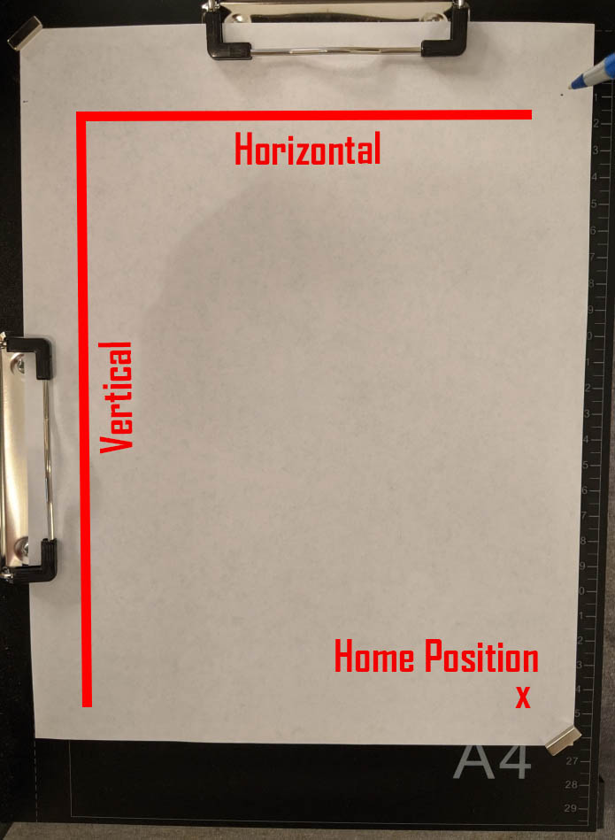
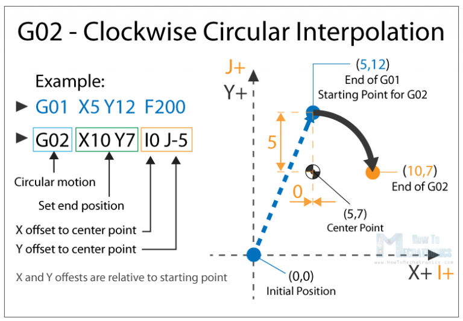
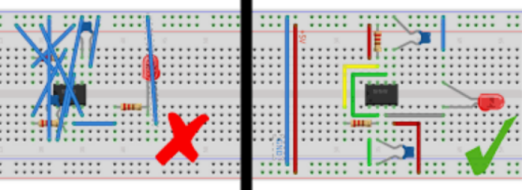
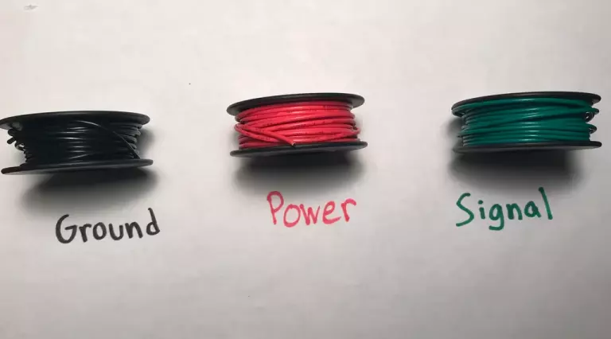

# Class-Instructions

Instructions for each checkpoint/deliverable in this class, as well as helpful setup/configuration instructions. Below are the design parameters for your XY Plotter, as well as some rules for the class.

## Project Specifications

FIRST: MAKE SURE YOU REFERENCE THE ASSESSMENT DOCUMENT ON ELC WHICH DESCRIBES THE UI FUNCTION OF THE PLOTTER.

Your objective this semester is to take an existing XY Plotter, deconstruct it, and implement it (along with some additional functionality) using a Raspberry Pi 4 and it's necessary accompanying hardware. 

As covered later, you'll be using Python to program, and two Raspberry Pi "Hats" which add Stepper Motor control for the X and Y stepper motors, and an LCD display. In addition to the hats, you'll also be using two digital encoders for input/controls and an H-Bridge chip to drive the Z axis stepper motor.

In addition to recreating the functionality of the original XY Plotter (X, Y, Z axis control) you will also be implementing three "Operating Modes" and an interactive menu system on the LCD display to select them as well as other operations such as calibration, homing, etc. These "Operating Modes" include an Equation Drawer, an Etch-A-Sketch mode, and a G-Code mode, parameters for which exist below.

You should strive to make this work as closely to a finished product as possible, meaning doing sufficient bug testing, and making the product "plug and play" or easy to setup/use. A part of this process is making sure your code runs on startup for the Raspberry Pi. A small writeup for how to do this can be [found here](deliverables/setup/launch-on-startup.md).

### Rotary Encoder Setup/Terminology

To limit confusion during demonstrations and videos, we've decided to standardize the position/function of the rotary encoders on your plotter. Below is a table with the terminology we have used in the documentation to distinguish the rotary encoders and specify their function. 

| Left-Hand Encoder | Right-Hand Encoder |
| ----------------- | ------------------ |
| Left Encoder      | Right Encoder      |
| X axis Encoder    | Y axis Encoder     |
| Horizontal Encoder| Vertical Encoder   |

With "Left-Hand Encoder" meaning the encoder normally controlled by the left hand, and the same for the "Right-Hand Encoder". 

### Etch-A-Sketch (Deliverable 7)

For the Etch-A-Sketch mode, your goal is fairly simple: recreate the functionality of the popular kids toy! You'll use the two digital encoders provided to control the X and Y axis to create a "manual" drawing mode.

- When spinning the encoder knobs clockwise, the X-axis should move "right" relative to its home position and the Y-axis should move "up" relative to its home position. Conversely, when spinning the encoder knobs counter-clockwise, the X-axis should move "left" relative to its home, and the Y-axis should move "down" relative to its home. 

In this mode, your code does not have to check limits on the paper. You can do this visually. However, your code should handle extreme mechanical conditions (see below).

Refer to the Assessments document for the UI interface. The encoders are your control input for the UI interface.  In other words, the only input you have are the control knobs. Do not use the inputs on the LCD.

As described in the UI writeup in the assessment doc, the encoder for vertical position will control up/down of the pen with a encoder press. The encoder for horizontal position will toggle speed slow/fast with a press. You can decide on slow and fast speeds but should be easy to see difference. When both encoder buttons are pressed simultaneously, the pen goes up, motors stop, and control goes back to the UI screen where the user can choose a different function/mode (see UI description).

- For your safety as well as the safety of the equipment, you should make sure the motors stop when encountering the X and Y endstop switches and when it has reached the opposite end of its gantry. In essence, make sure the motors do not attempt to go where they can't.

### Calibration Mode (Deliverable 8)

There are two calibrate mechanisms: Auto Calibrate and Pen Position Calibrate,

Auto Calibrate determines the mechanical limits of the plotter using X and Y endstop limit switch inputs.  You will use this information to calculate the opposite mechanical endpoints of the plotter.  Make sure to use a safety factor for the mechanical endpoints once found (25 mm is good).

Pen Position Calibrate determines the fixed paper home position which is used as a reference for the "home" position on the paper, meaning the bottom right corner of the page, as described below. With a fixed paper size, this "home" position will provide you with the information required to calibrate your Math Mode and G-Code mode properly.  The main point of the manual calibration mode is to set the reference "X" position for your paper.  Once the reference "X" is known, you will be able to find the center point of the paper and limits of the paper.

Make sure you implement this mode and all others through the LCD panel and user input with PWM.  See the Assessment document for UI menu information.

Before beginning the Math Mode, you should implement the auto-calibration feature and the Pen Position required for determining the plotter and paper limits.

A letter sized sheet of paper (8.5” x 11”) will be placed on the dotted lines on the plotter platform. You will assume 25mm margins on each side of the page. The origin or "home" position for your Math Mode and G-Code Mode will be the bottom-right corner of the page (see photo below) with 25mm (1 inch) from either side of the page.  Use the Pen Position Calibrate to "set" this position for your code. Once you have this point, you can calculate the three other edge points and the center of the paper for your drawing.

The Y-axis endstop should already be very close to the 25mm limit without additional adjustment. The 8.5" x 11" paper will be lined up with the upper left hand side of the silk screening on the base of the plotter, as seen below:

### Math Mode (Deliverable 10)

For the Math Mode, you will design an algorithm to graph several given functions. These functions will be provided ahead of time and can be ‘hard-coded’ into a Python script to be run. Again, refer to the UI description in the Assessment document.

After doing calibration (Auto and Manual), your plotter should navigate to the middle of the page, which will act as the origin of the graph. From the origin, you will need to draw very basic axes which extend 6 cm in each direction (12 cm total length), both positive and negative (left, right, up, and down relative to the origin). This sets a reference axis for the plot.

You will be expected to graph the following functions, in units of mm:

where the constants: `m`, `b`, `a`, `c`, and `r` will be given as input to your program.  Note: make sure your code handles +/- integer number inputs for the constants.  

**Your plotter should plot the function to the margins (25 mm on each side) of the paper. At the margins, the pen should go up. If only a small piece of the plot is on the paper, then plot it on the paper. If none of the function is on the paper, do nothing and alert the user in some way.**

Once again, your rotary encoder knobs are the only input for the user. The "vertical" will be increments of +/-10mm and the "horizontal" increments of +/-1mm. Positive is clockwise. When the "vertical" encoder is short pressed, the selected value is entered and the cursor is moved to the next value to be set. If the "vertical" encoder is short pressed on the last value to be entered, the cursor moves back to the first value. When the "vertical" encoder is long pressed, the Math Mode starts (have an "are you sure?" dialogue). When the "horizontal" encoder is short pressed it goes up one level in the Math Mode menu, and when long pressed, it goes to the top of the Math Mode menu. As specified in the UI section of the Assessments document, your Math Mode should also halt, raise the pen, and go back to the menu/UI when both of the Encoders are long-pressed.

As part of the Math Mode checkpoint, you should also implement stand alone mode on the Pi. The Pi will no longer need to have a computer tethered to it to work!  
As mentioned in the Project Specifications section of the README, you should have your code [launch on startup](deliverables/setup/launch-on-startup.md) (when you power on the Pi)
to reduce the setup time/equipment needed for your demo. This is a requirement for this demonstration and all future demonstrations.

### G-Code (Images courtesy of howtomechatronics.com) (Deliverable 13)

The final mode to implement is a very simple [G-Code](https://en.wikipedia.org/wiki/G-code) interpreter. Two sample G-Code files will be provided to you that can be saved onto the Pi. Your control interface should have a menu item to select either of these files and the plotter will run through the written G-Code commands.  Refer to the UI description in the assessment document. As mentioned in the Project Specifications section of the readme, you should have your code [launch on startup](deliverables/setup/launch-on-startup.md) (when you power on the Pi) to reduce the setup time/equipment needed for your demo. This is a requirement for this demonstration and all future demonstrations.

As with the Math Mode feature, the G-Code interpreter will assume 25mm margins on the paper, with the "home position" or (0,0) of the plotter being in the lower right corner of the page/margins similar to Math Mode.  The Paper Pen Position Calibration will "set" the (0,0) position.  Notice this means the G-code does not reference (0,0) as center of paper! Rather, (0,0) for the G-code interpreter means the lower right corner of the margins (25 mm from the bottom and right sides of the page).

As noted in the commands below, you will need to be able to adjust the speed of your stepper motors in mm/minute. This should relate to the artificial "delay" between step commands, with a larger delay correlating to a slower stepper speed or "feedrate".

You will need to implement the following commands:

- **G00 - Rapid Positioning**

    The G00 instruction rapidly moves the pen head linearly from the current position to the end position provided, inherently using the maximum "feedrate" (mm/minute) or stepper speed.

    

- **G01 – Linear Interpolation**

    The G01 instruction moves the pen head linearly from the current position to a target position, utilizing a linear interpolation algorithm. As shown below, a feedrate (in mm/minute) is also specified. Feedrate is stepper speed for our application.
    
    

- **G02 – Circular Interpolation Clockwise**

    The G02 instruction moves the pen head in a clockwise circular direction from the current position to a target position along a circle whose center point is specific as an offset of the current position as shown and explained below:

    

- **G03 - Circular Interpolation Counter-Clockwise**

    The G03 instruction operates exactly as the G02 instruction does, except moving in a counter-clockwise direction along the circle.
    
    

- **G28 – Return Home**

    The G28 command tells the machine to move the tool to its reference point or home position. Since we have convenient X and Y axis endstops already on the plotter, we can use these to establish a good home position, given we know where the endstops put us on the paper and where our desired home position is.

- **M02 - End of Program**

    The M02 command signifies the end of a G-Code program. We will use this command to tell your plotter to execute a 'stop' or 'end of program' function which will raise the pen and send the plotter to its home position.

- **M03 - Pen Down**

    We'll use the M03 command to tell the parser to plotter the pen in the down position until otherwise interrupted or raised.

- **M04 - Pen Up**

    We'll use the M04 command to tell the plotter to raise the pen.

You can assume absolute positioning and units of mm for all commands. For more reference of G-Code and it's commands, use these links as reference:

- [How to Mechatronics](https://howtomechatronics.com/tutorials/g-code-explained-list-of-most-important-g-code-commands/)
- [The RepRap Project](https://reprap.org/wiki/G-code#G0_.26_G1:_Move)

Note: These resources may contain different meanings or extra parameters for some G-Code commands. Be mindful of this and only implement what has been laid out above.

In addition to implementing the above commands, you'll need to be able to parse a `.gcode` file given to read and execute the commands in the order that they appear. You don't have to create your own files or create a GCode slicer for this project, we will provide you with two test files and create an additional `.gcode` file to use in your demo. To go along with this, with the `.gcode` files placed in a pre-determined directory, you'll need to be able to select the `.gcode` file to parse from the UI menu.

As specified in the UI section of the Assessments document, your GCode Mode should also halt, raise the pen, and go back to the menu/UI when both of the Encoders are long-pressed.

### LCD/Encoder Interface

Finally, you should create a User Interface using the provided 2x16 LCD display and digital encoders. The interface should provide access to and facilitate the use of each of the operating modes, as well as provide and accept any other configuration information or calibration options/operations.  The PWM digital ecoders (knobs) will be used to provide input to the user with interaction via the LCD display.  We are not using the inputs directly on the LCD display to save available GPIOs for your use in the project if needed.

Use the [interface on the Prusa i3 3D printer](https://help.prusa3d.com/en/article/lcd-menu-original-prusa-i3_142322) as inspiration.

### Documentation Expectations

Your project will have three required documents: 

1. A User’s Manual
    
    - Write a complete step-by-step document instructing a novice user how to use your plotter. Think about your plotter as a product bought by the user. The manual will instruct the user on all of the functions of your plotter. 
    - From your own experience, pictures, drawings, diagrams, etc… make a user’s manual much more beneficial. 
    - Don’t forget to think about a section on errors or what might go wrong, faqs, clarification, etc. 
    - User Manuals also contain safety information for the user.

2. A full Technical Description of the Design

    - Write a complete technical design guide for your plotter. It should describe every facet of the design (hardware and software). It should allow a person skilled in the art to recreate your design. It should provide appropriate technical reasoning for design decisions including simulation, circuit schematics and design tradeoffs.
    - Multisim, photos of oscilloscope simulations, photos of circuits, Logic.ly simulation, Code examples for key parts of algorithms (the full code will be uploaded on GitHub), and paper worked out notes are all examples. Some of these can also be part of and come from the project management document (see below).
    - At a minimum, each progress deliverable and design deliverable should be ***WELL*** documented and occupy a chapter in the document.
    - Because every group will have different approaches to the solution, we can not give a complete requirement that every document must contain. In short, if there is something that makes your plotter work, you must document it.
    - What if your group did not design it? One example is the mechanical structure of the plotter itself. In this case, like in any technical document, you must reference the source. You should also describe the function but do not need to get into the design details (structural stress of the aluminum, for example).
    - What about your software? Each primary function probably has code written for it. Therefore, your document should include a chapter on the structure of your software.  Think about this as the table of contents and flow control for your software. Each of the plotter’s features/functions that includes software and hardware is most likely a progress or design deliverable and will have a chapter in the document. Use the deliverable chapter to more fully describe the software and hardware.  
    - If you used pre-written libraries, you must reference them and briefly describe the function. Any code that you wrote from scratch should be well documented (and commented in the code).
    - Neatest, precision, and completeness will be assessed. Professionalism in content and in the presentation will also be assessed.

3. A Weekly Project Management Report

    - This is a weekly progress of your group’s design trajectory. It should document decision discussions, roles/responsibilities for each group member, work done, tracking of schedules for the project, etc.
    - In general, it will be equivalent to a “lab notebook” for the project. It is not to be a structured, edited document. It should mirror your group’s successes and failures working on the project.    
    - At the end of the semester, each team member will submit a reflection on the semester project as part of the project management report.
    - You will be submitting a weekly project management report on ELC.

To create and collect this documentation, you are free to use whatever tools you and your team desire such as Google Docs, Microsoft Word, etc. However if you'd like to keep all of your work in one place on the Github, we've provided a primer for writing documentation using Markdown and Github in the "docs" folder of your group repository.

### Submitting Work

When submitting work for this class, it will go in the deliverable assignment folder for that week. This includes any work needed for **P** and **D** deliverables, your Weekly Project Management Report, etc. Any code for your group should remain on your group GitHub repository, and you should make sure to update this with your latest work before deliverables are due.

When submitting pictures or videos as part of your deliverable, be sure to have your subject in focus and easily seen. Make your videos short and to the point, and make sure you don't have shaky hands while you're filming.

When submitting writing of any kind, make sure it's clear, concise, and overall decent to read. When formatting is necessary, you can assume 1.15 line spacing, and 12 pt Times New Roman or Calibri font.

## Project Rules

Below is a set of rules to follow while working on this project in addition to any established on the syllabus. These are generally best practices for keeping your project organized and on track.

### Breadboard Wiring

When wiring up components with a breadboard it is crucial that your wires stay organized and distinguishable. If you don’t follow these practices, you’re likely to screw up the wiring for your XY Plotter often, which not only leads to frustration and wasted time, but could also be fatal for your more sensitive components such as the H-Bridge chip or the Raspberry Pi. If you follow these steps, you will be well on your way to avoiding the most common pitfalls:

1. ### Use Clean Wiring

    

    Keep your wiring clean. Avoid excessively long wires which make it impossible to trace if there is a problem and are more prone to pull out. You can either purchase wires that are pre-cut to different lengths or make them yourself.

2. ### Use Color Coding

    

    Another tip is to organize your wires so that the color matches the circuit's electrical property. This will help you identify what types of wires are which when troubleshooting your breadboard circuits. The most common wire color coding is that all POWER wires should be RED, and all GROUND wires should be BLACK.

    As you get more advanced, you can have different colors representing different voltage levels and functions. For example you can add a separate color for digital signals with 5V logic, and another for 3.3V.

    For analog circuits, you may want to have a specific color for an amplifier input or output, and yet another color to identify an ADC input.

    Besides organization, this will really help you spot mis-wirings before you apply power and potentially damage your hardware. Keep a careful lookout for RED and BLACK wires connecting to the same terminal strip, as this could indicate a short.

### Cases/Housings

To facilitate a more 'clean' look and feel to your final plotter, we suggest that teams design and manufacture a custom case for their Raspberry Pi and other hardware. The case can be manufactured using anything found in the Fabrication Lab (Remember, there are other ways to rapidly manufacture than 3D printing!) such as the wood/acrylic laser cutter, waterjet cutter, 3D printers, and much more. Some additional guidelines for the case/housing are given below. While adherence to these are not required, they are generally good practice:

- The case must hold the Raspberry Pi as well as the additional hardware used (hats, encoders, breadboards, etc.) with the only hardware outside of the case being the Plotter itself, the power supply, and wiring.
- You should aim to make the case compact, with a maximum size of 8" on each side.
- Your wiring out of the case should be clean, meaning nearly all wires exit the case in only 1-2 spots.
- You should take cooling for the Raspberry Pi, Adafruit Motor Hat, and H-Bridge chip into consideration as ventilation holes are mandatory and use of fans and heat sinks are strongly suggested (This could also give you a performance advantage).
- User Interface devices (encoders, LCD, etc.) for your plotter should be clearly visible and easy to use.
- In general, the custom case should be an improvement on the provided one in terms of cleanliness, easy of use, and protection/support of your sensitive components.

To get you started, here are some existing designs for Raspberry Pi cases on [Thingiverse](https://www.thingiverse.com/search?q=raspberry+pi+4+case&type=things&sort=relevant).

### Code Style/Conventions

Your code should follow the commonly accepted code style conventions outlined in [PEP 8](https://www.python.org/dev/peps/pep-0008/) on the official Python website. In addition to the practices outlined in PEP 8, you should follow [Object-Oriented Programming](https://en.wikipedia.org/wiki/Object-oriented_programming) principles when necessary (we'll generally let you know if something needs to be a class) and avoid creating [monolithic](https://en.wikipedia.org/wiki/Monolithic_application) software; instead opt to break your software into smaller, more manageable and maintainable pieces.

While mildly outlined in the PEP 8 document above, we'd like to reiterate that commenting your code is crucial to both the development and grading process. A good rule of thumb to follow is that a comment should *only* be added to answer a question that the code can't. In essence, if you follow the PEP 8 naming conventions and give your variables/objects meaningful names, it won't take very long to understand most code; in some ways, the code *becomes* the documentation. However, if you use a little optimization trick here, or implement a complicated operation/algorithm there, you should add a comment explaining your implementation or methodology.

### Maintaining your Group Github Repository

In order to encourage you to learn the useful skill of managing and using a Git/Github repository, we ask to keep your group repository up to date, follow the [Github Flow](https://guides.github.com/introduction/flow/) and to use Git/Github features like [issues](https://guides.github.com/features/issues/) to your advantage! More information on Git/Github and how to learn it will be provided in the deliverable instructions.

### Class Discussion

To facilitate class discussions, we will be using this repository’s **Issues** page to post comments or questions. This is a great place to ask general questions pertaining to the course and project. You are encouraged to join the discussion but just remember to abide by the “Collaboration Policy” detailed in the course syllabus. 

To post a question or comment, see the Issues link at the top of the repository or follow this [link](https://github.com/Herring-UGAECSE-2920/Class-Instructions/issues). The submission process is self explanatory. 
