# Deliverable 11

Through deliverables 11, 12, and 13 you'll be designing the 'GCode Mode' outlined in the [README](../README.md) of this repository. In addition to beginning your GCode Mode design, you'll also be comparing your team's power supply design with the one we gave to you for your plotter.  (See an example of Gcode syntax in the README).

## Design Proposal (P)

To start, create a rough design proposal outlining what you and your team think would be the correct way to implement this functionality. It is not necessary to stick completely to the design proposal as you get into the weeds, but you should take it seriously as a planning exercise for this portion of the project. In your proposal, document how you would implement the individual points of functionality outlined below:  (For all items, make sure to see the readme and the assessment document for clarifications).

The final mode to implement is a very simple [G-Code](https://en.wikipedia.org/wiki/G-code) interpreter. Two sample G-Code files will be provided to you that can be saved onto the Pi. Your control interface should have a menu item to select either of these files and the plotter will run through the written G-Code commands.  Refer to the UI description in the assessment document. As mentioned in the Project Specifications section of the readme, you should have your code [launch on startup](setup/launch-on-startup.md) (when you power on the Pi) to reduce the setup time/equipment needed for your demo. This is a requirement for this demonstration and all future demonstrations.

As with the Math Mode feature, the G-Code interpreter will assume 25mm margins on the paper, with the "home position" or (0,0) of the plotter being in the lower right corner of the page/margins similar to Math Mode.  The Paper Pen Position Calibration will "set" the (0,0) position.  Notice this means the G-code does not reference (0,0) as center of paper! Rather, (0,0) for the G-code interpreter means the lower right corner of the margins (25 mm from the bottom and right sides of the page). This home position is different than the "start" position for each GCode instruction. 

As noted in the commands below, you will need to be able to adjust the speed of your stepper motors in mm/minute. This should relate to the artificial "delay" between step commands, with a larger delay correlating to a slower stepper speed or "feedrate".

You will need to implement the following commands:

- **G00 - Rapid Positioning**

    The G00 instruction rapidly moves the pen head linearly from the current position to the end position provided, inherently using the maximum "feedrate" (mm/minute) or stepper speed.

    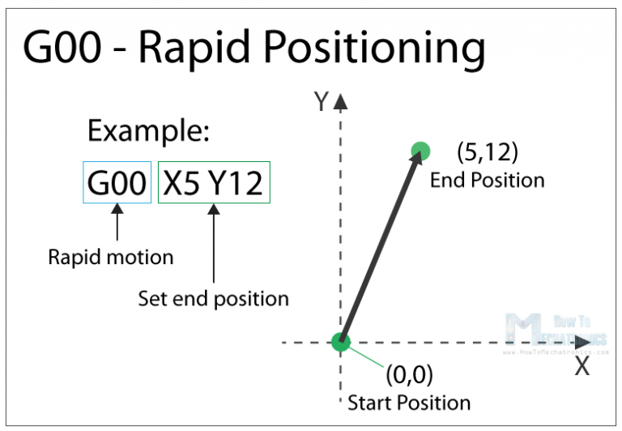

- **G01 – Linear Interpolation**

    The G01 instruction moves the pen head linearly from the current position to a target position, utilizing a linear interpolation algorithm. As shown below, a feedrate (in mm/minute) is also specified. Feedrate is stepper speed for our application.
    
    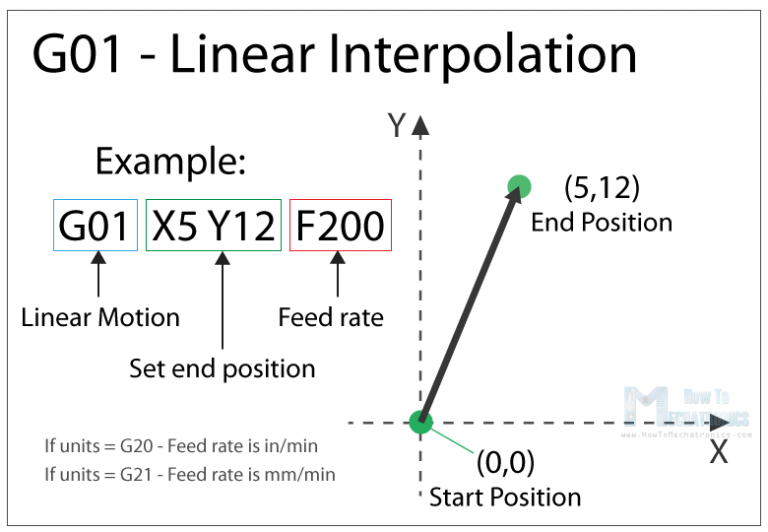

- **G02 – Circular Interpolation Clockwise**

    The G02 instruction moves the pen head in a clockwise circular direction from the current position to a target position along a circle whose center point is specific as an offset of the current position as shown and explained below. Please note that the center point of the circle is specified as an offset of the starting point for the command (I and J):

    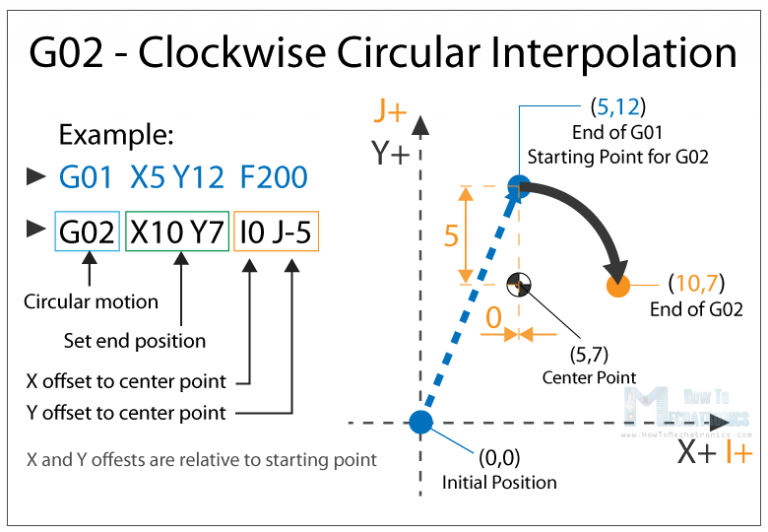

- **G03 - Circular Interpolation Counter-Clockwise**

    The G03 instruction operates exactly as the G02 instruction does, except moving in a counter-clockwise direction along the circle.
    
    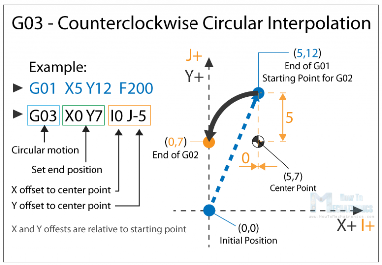

- **G28 – Return Home**

    The G28 command tells the machine to move the tool to its reference point or home position. Since we have convenient X and Y axis endstops already on the plotter, we can use these to establish a good home position, given we know where the endstops put us on the paper and where our desired home position is.

- **M02 - End of Program**

    The M02 command signifies the end of a G-Code program. We will use this command to tell your plotter to execute a 'stop' or 'end of program' function which will raise the pen and send the plotter to its home position.

- **M03 - Pen Down**

    We'll use the M03 command to tell the parser to plotter the pen in the down position until otherwise interrupted or raised.

- **M04 - Pen Up**

    We'll use the M04 command to tell the plotter to raise the pen.

You can assume absolute positioning and units of mm for all commands. For more reference of G-Code and it's commands, use these links as reference:

- [How to Mechatronics](https://howtomechatronics.com/tutorials/g-code-explained-list-of-most-important-g-code-commands/)
- [The RepRap Project](https://reprap.org/wiki/G-code#G0_.26_G1:_Move)

Note: These resources may contain different meanings or extra parameters for some G-Code commands. Be mindful of this and only implement what has been laid out above.

In addition to implementing the above commands, you'll need to be able to parse a `.gcode` file given to read and execute the commands in the order that they appear. You don't have to create your own files or create a GCode slicer for this project, we will provide you with two test files and create an additional `.gcode` file to use in your demo. To go along with this, with the `.gcode` files placed in a pre-determined directory, you'll need to be able to select the `.gcode` file to parse from the UI menu.

As specified in the UI section of the Assessments document, your GCode Mode should also halt, raise the pen, and go back to the menu/UI when both of the Encoders are long-pressed.

**P**: The design proposal should be relatively short, approximately 2 pages with 1.15 line spacing, Times New Roman, 12 pt font.

## Begin Designing, Testing, and Documenting Your Design (P)

When you have completed your design proposal, you are free to start experimenting with getting the GCode mode working. While no specific thing is required for this week, you should be making good progress on the Math Mode. As a goal for this week, have the some of the more basic GCode instructions (G00, G01, M03/04) implemented and begin implementing some of the UI functions required for this mode (file select). There is no "P" deliverable due for this item to turn in this week. You need to be looking forward to the accompanying design deliverable which is due Friday, April 16th.

## Compare Your Power Supply with an "Off The Shelf" Design (P)

As a conclusion to the Power Supply Design portion of this course, you all will compare your power supply design to that of a standard 60W laptop charger (the one we gave you for your plotter). The consumer power supply we gave you has the common [Flyback Converter](https://en.wikipedia.org/wiki/Flyback_converter) design, which you can read about in a little bit of detail from [this textbook clipping](resources/flyback-power-supply.pdf).  Note the pages on the scan are out of order. 

The purpose of this assignment is to take what you've learned from designing your own power supply and determine what you did right or wrong, and what features (which we didn't ask you to implement) make the commercial power supply safer, more reliable, and generally better.

Below we have provided a series of pictures of the given power supply taken apart so you can see its components/design. Your objective is to identify key differences in components and layout, and describe/illustrate these in a short (~2 pages) writeup.

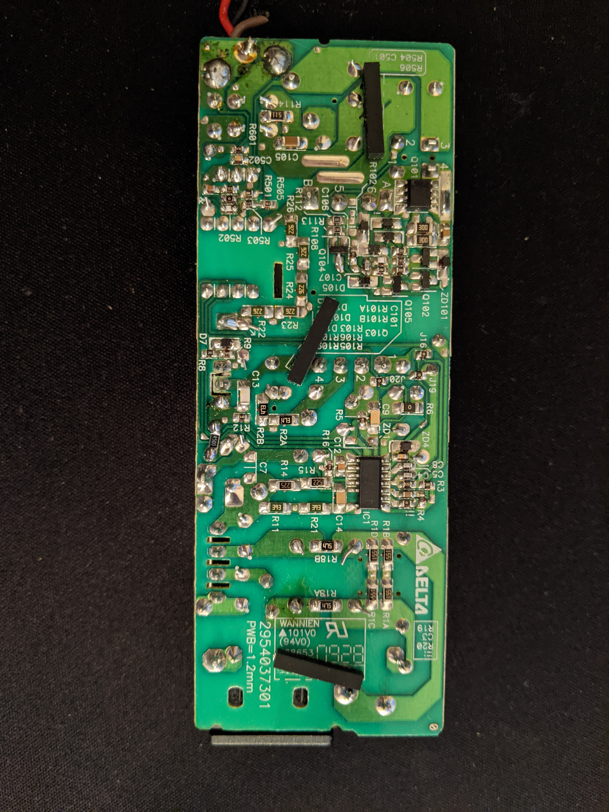

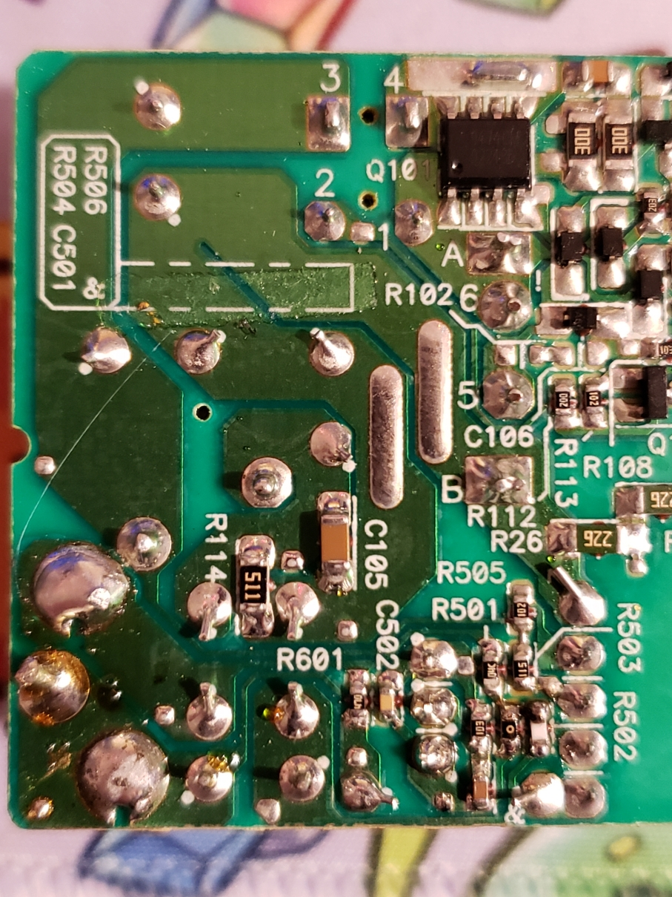

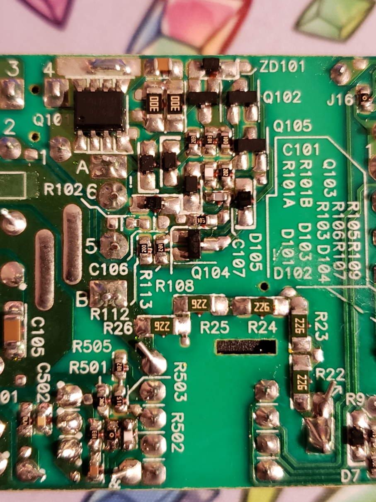

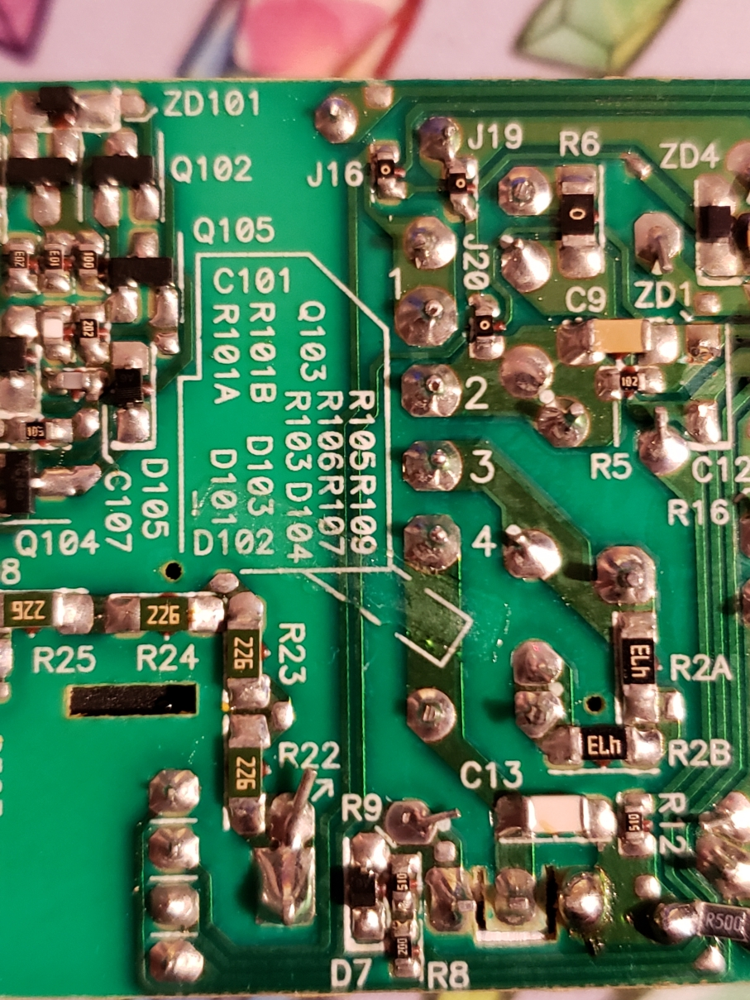

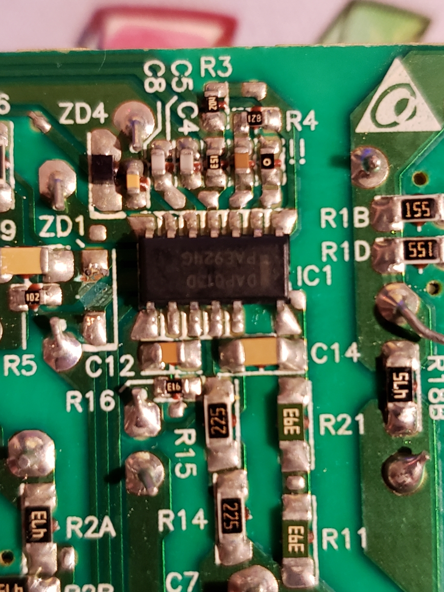

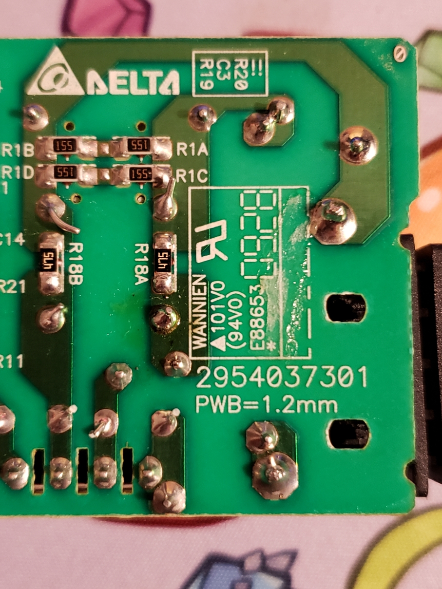

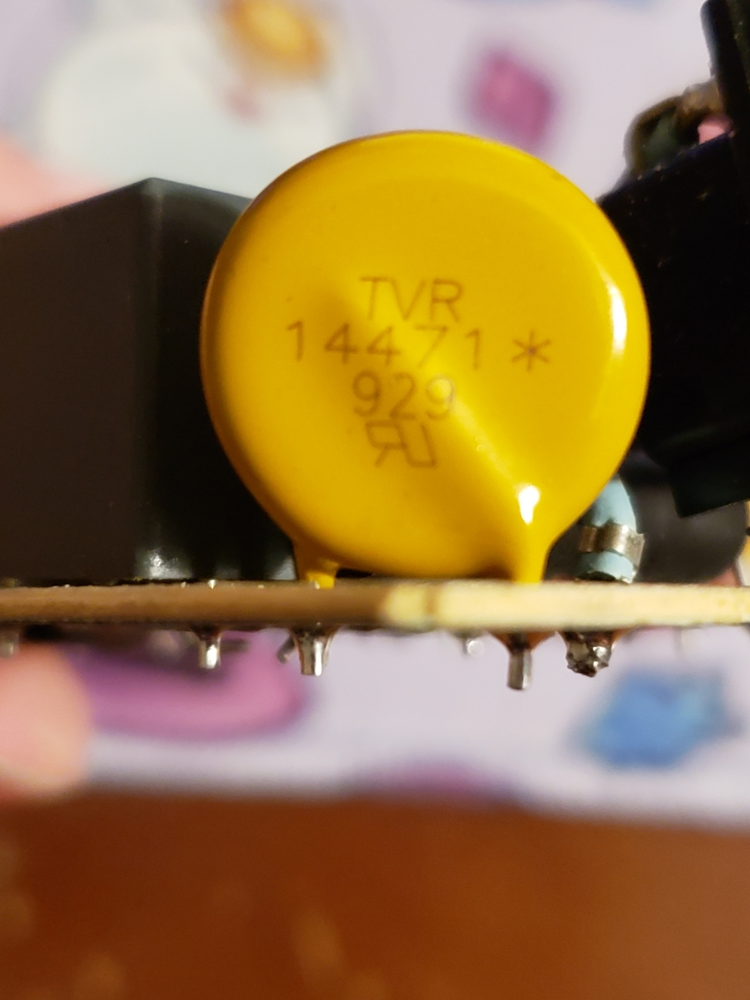

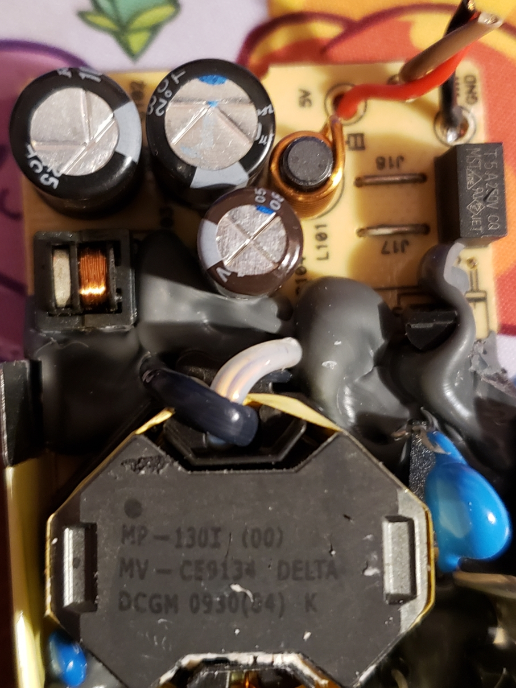

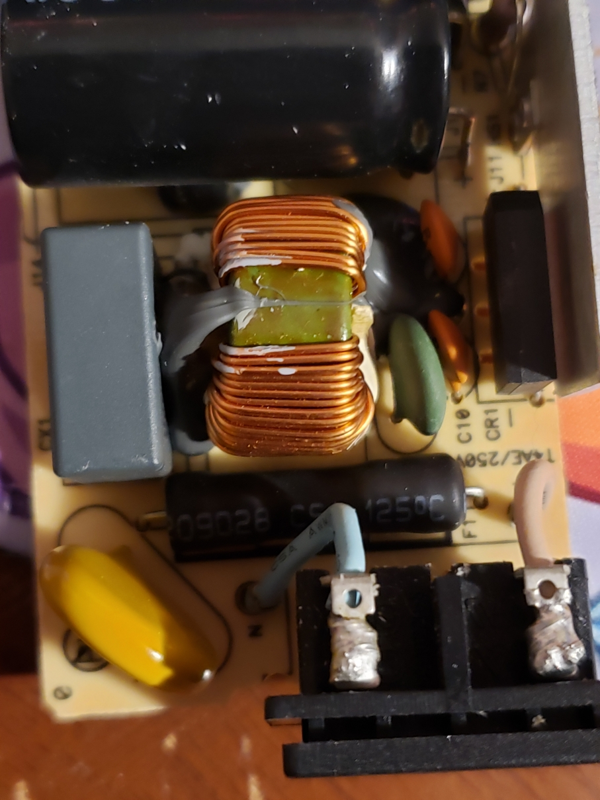

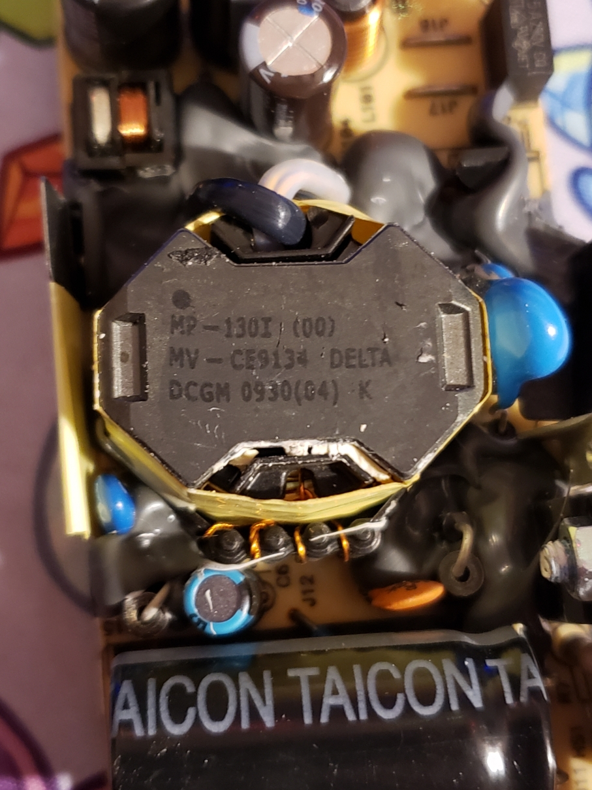

**P**: The writeup should be approximately 2 pages with 1.15 line spacing, Times New Roman, 12 pt font. You may include pictures of your power supply design for illustration.

# Summary

In summary, for this week you need to:

1. Submit your **P** deliverable items (Design Proposal, Power Supply Comparison) to the Progress Deliverables 11 assignment folder on ELC. You do not need to submit code on ELC, just make sure your GitHub repository is up to date and contains the needed scripts.

3. Update your User Manual and Technical Documentation with your findings.

4. Submit your Weekly Project Management Report to the Deliverable 8 assignment folder on ELC.
