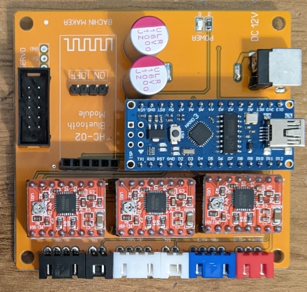
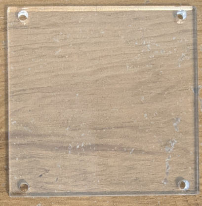
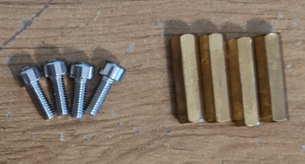
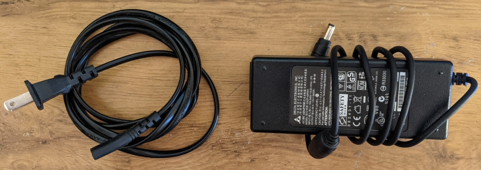

# Deliverable 2

For this week, completing a syllabus quiz, you'll be creating a team attendance sheet, documenting the behavior of the existing XY-Plotter provided and going through the preliminary setup for the Raspberry Pi hardware. Finally, You'll need to return your unused hardware to Dr.Herring, Dr.Trudgen, or the TAs by class on Friday.

Right now would also be a good time to read through the rules for the project outlined [in the README](../README.md) for this repository.

## Team Attendance Sheet (P)

Each class period, circumstances withstanding, at least two members of your team should be in attendance to ask questions, participate in class discussion, do activities, etc. However, due to the limited capacity of our classroom (~half of the class size at 40 people) you all will need to get with your group mates and create a schedule such that ***all*** of you can come to class during the semester. 

**P**: Since most teams will have 5 or 6 people, you will have to create some form of attendance rotation. Create this schedule and include it in your submission for this deliverable.  Note, at least 2 members must be present for each class (3 team members for 6 person teams) and all other team members are on ZOOM.  The rotation cannot change.  Each student is either attending on Monday or Friday.  We will allow a day change after midterm.  Note, all teams can send 3 member each day if they want.  On days with presentations, all team members must be present.  

## Documenting Existing Behavior (P)

For this section of the deliverable, you'll be following [this guide](./setup/plotter_setup.md) to assemble and use your plotter as well as make some small modifications to it. When you finish, make sure to set aside the following parts to return to Dr.Herring, Dr.Trudgen, or the TAs:

1. Control Board
    
    

2. Control Board Plexiglass
    
    

3. Control Board Mounting Screws and Long Brass Standoffs (x4 each)

    

4. 12V 5A Power Supply

    

You should hang on to the rest of the hardware that came with the plotter, as you'll be needing the shorter brass standoffs and the allen wrenches for putting the new 350mA stepper motors on (you'll receive those in the coming weeks). We also recommend keeping the existing wiring harness intact, as it's already well organized/laid out.  

Do not attempt to use the motor hats or stepper motors with your raspberry Pi until instructed to do so.  In fact, the stepper motors that are installed on the plotter out of the box **WILL blow the motor hat driver**.  If this happens, your team will need to replace the motor hat. So, don't do it.

## Raspberry Pi Setup (P)

Finally, you'll need to go through the Raspberry Pi setup documentation found [here](setup/pi_setup.md). It will guide you through setting up the Pi and getting all of the Python dependencies and environment set up. It will also link to helpful documentation for how to work on the Raspberry Pi, remotely or otherwise.

# Summary

In summary, for this week you need to:

1. Make sure you have acquired all of the hardware for your team.

2. Create your team attendance sheet and upload it to the Deliverable 2 assignment folder on ELC.

3. Document the existing behavior of the plotter by taking notes/pictures/videos (add these to your Weekly Project Management Report).  Upload a short video (30 seconds or less) to the Progress Deliverables folder on ELC.  You can also attach a link to your short video.

4. Go though the Raspberry Pi setup, and acquaint yourself with working on the Pi/Github/etc.

5. Update your User Manual and Technical Documentation with your findings.

6. Submit your Weekly Project Management Report to the assignment folder.  Note, do this every week.  It will not be here to remind you each week!