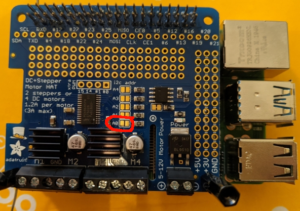

# Deliverable 4

For deliverable 4, you'll be modifying the plotter for use with the new hardware, and wiring up your Adafruit Motor Hat for use with the X and Y axis stepper motors on the Plotter. However, before you test control over the motors using software, you'll need to pass the wiring safety checkpoint and return the modified/disassembled hardware as described below.

## Replacing the Steppers (P)

Once you've completed the wiring safety checkpoint, you'll need to go though [this document](setup/plotter_steppers.md) outlining how to replace the X and Y steppers with the new, lower current steppers. When you finish, take pictures of the modified sections as proof of completion. Also, make sure to set aside the following parts to return to Dr.Herring, Dr.Trudgen, or the TAs:

1. X Axis Stepper Motor

    

2. Y Axis Stepper Motor

    

As proof of completion, take a picture of the new X and Y steppers mounted to the plotter.

## Using the Adafruit Motor Hat to Control a Stepper (D)

>***Warning: DO NOT USE the X and Y axis stepper motors that came attached with the Plotter, only use the lower-current motors we have provided you with the Adafruit Motor Hat. The motors that came with the Plotter can draw 1.6A concurrently, while the motor hat can only provide up to 1.2A concurrent per motor.***

Next, you'll need to demonstrate that you can use the Adafruit Motor Hat to control one of the 350 mA stepper motors we gave you. You may use the motor either on or off the Plotter rig itself, but make sure there are no obstructions or other mechanical issues with the Plotter rig before using the motor.

**D**: To demonstrate control over the stepper motor, create a Python script to move the motor clockwise for 1 second, and then counter-clockwise for 1 second, continuing this until the program is halted (Ctrl+C on the command-line).

For this portion, you'll be using the already installed Adafruit Python Library made for this kit/hat. [Here is great walkthrough](https://learn.adafruit.com/adafruit-dc-and-stepper-motor-hat-for-raspberry-pi/using-stepper-motors) for how to use the motor hat with the accompanying library, this goes through software and hardware setup. 

Before you begin, you should solder the `A0` jumper on the Adafruit Motor Hat, which sets the `I2C` (the communication protocol used by the board) address to `0x61`, such that it won't conflict the the address used by the LCD display (`0x60` by default for both). The jumper can be found near the heat sinks on the board as shown below:



Before attempting to solder, first identify the person in your group most comfortable with soldering. A steady hand and a little bit of experience will go a long way. That being said, if no one in your group is exceptionally comfortable/skilled, there's no need to worry, as soldering a jumper is one of the easier things you can do.

Before you begin, make sure you have access to a soldering kit of some kind, all you'll need is a soldering iron, some thin(ish) solder (around .032 diameter is ideal), and a safe place to do it (though, if you have it, solder flux is also recommended).

To solder the jumper, first heat up your soldering iron to around 550-600&deg;F. When it's well heated, make sure to 'tin' the tip by running some solder onto it, letting it melt. Now, bring the tip to one of the pads for the jumper and heat it, slowly adding a little bit of solder when it's up to temperature; do the same for the other pad. When both pads have a little solder on them, reheat one of the and add a little more (enough to cover the gap), and drag the wet solder over the gap to the other pad, creating the bridge. That's it! If you need a visual aid to figure out how to do it, [this YouTube video](https://youtu.be/qIaxTv6jVvc?t=92) illustrates it well.

> Note: Soldering the jumper also means that when you instantiate your `MotorKit` object(s), you need to add the `address` option as below:

>```python
>kit = MotorKit(i2c=board.I2C(),address=0x61)
>```
## Connecting the Motor Hat and LCD Hat to the Pi

To relieve strain on the board and pins of the Hat's and Pi, we will be using the metal standoffs and nuts that were included in your kit. The spacers are not the exact length but they will do the job for this project. The spacing between the Pi and Motor Hat will use a spacer with a nut. The spacing between the Motor Hat and LCD Hat will use two spacers stacked on each other. See the below image as a reference.


## Wiring Safety Checkpoint for H-Bridge IC (P)

Before demonstrating control over the Z axis motor (pen up/down motor) with the [H-Bridge chip](https://www.ti.com/lit/ds/symlink/sn754410.pdf), you'll need to ensure that it, along with the [5V linear regulator](https://www.mouser.com/datasheet/2/308/MC7800_D-1773680.pdf) we'll use to power it, are connected up correctly. This is a wiring diagram on paper mapping the appropriate GPIO, 5V power from the regulator, and z-axis stepper motor leads to the H-Bridge chip. Double check your paper circuit and get with Dr. Herring, Dr. Trudgen, Kevin or Jake with questions you might have.  We strongly suggest that you may also want to verify your regulator circuit by breadboarding the setup in Driftmier 1450 or 1409 and documenting your work.  In fact, this is a great way to show that you prototyped your work in your WPM and your techinal project report for end of semester, hint... hint.

The Z-axis stepper motor needs around 5V and 800mA of current to be driven, which will be supplied by the 12V to 5V linear regular we will give you. It is up to you to determine how to wire and control the Z-axis motor using the H-Bridge chip. 

# Summary

In summary, for this week you need to:

1. Before attempting to start the design deliverable, please make sure you have completed the wiring safety and stepper replacement checkpoints as outlined in [deliverable 3](deliverable3.md) and above respectively.

2. Submit evidence in the form of pictures/videos for your stepper replacement checkpoint to the Progress Deliverable 4 assignment folder on ELC.  These are **short** videos (no more than 30 seconds).

3. Submit evidence in the form of pictures/videos for your **D** deliverable item to the Design Deliverable 4 assignment folder on ELC. You do not need to submit code to ELC, simply ensure your group GitHub repository is up to date and contains the needed scripts.

4. Turn in the original X and Y stepper motors that came with the plotter in Class on Friday.

5. Bring your wiring diagram for the H-Bridge/Z-axis stepper to class on Friday to be checked off.

6. Update your User Manual and Technical Documentation with your findings.

7. Submit your Weekly Project Management Report to the Deliverable 4 assignment folder on ELC.
