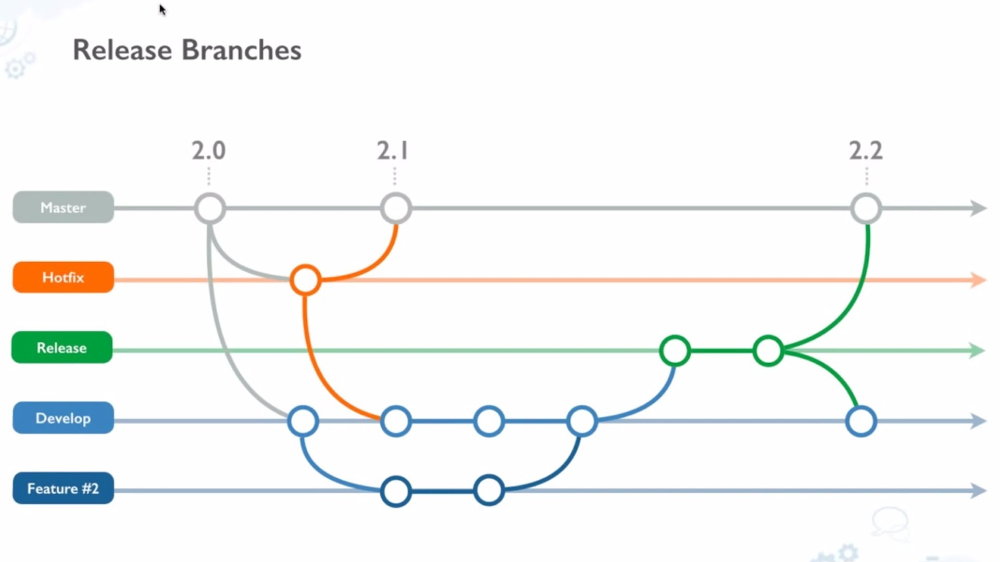

# Guide to Working with Git/GitHub

As mentioned in the [Working on The Pi](working_on_pi.md) document, learning how to properly leverage Git and GitHub is vital in the success of your project. It solves many of the common problems and headaches associated with large software projects, and working with teams. In this guide, we'll go through the basics of using Git and Github then move on to effectively working with teams using some more advanced features such as branching, merging, and pull requests.

## Git Basics

If you haven't already, please install and setup Git on your computer, and connect it with your GitHub account using [this guide](https://docs.github.com/en/free-pro-team@latest/github/getting-started-with-github/set-up-git).

When you're done with that, read through the [Git Handbook](https://guides.github.com/introduction/git-handbook/) created by GitHub, which goes through what Git is, how GitHub fits into the equation, and the basics of how to use it. It also introduces some of the more complex concepts we'll look at later. 

After you've read through the guide, you should have a cursory understanding of what Git is, how it works, and how to do some basic operations with it. To make sure you and your team are following along, you'll do a small exercise is the simply work through the [GitHub Hello World](https://guides.github.com/activities/hello-world/) exercise by creating a repository as instructed on your personal GitHub (not the class organization). Go through of the steps in the guide, and submit a link to your repository as part of your submission for this assignment.

## Working with Teams

Now that you've got a handle on the basics, we'll go through some of the features and concepts you'll need to know to effectively use Git and GitHub when working with teams.

### Branching

Since you are your team will likely, and certainly should, have multiple people working on your codebase, it can be a challenge to keep work separated and contained so that your programmers aren't stepping on each others toes. [Git branching](https://git-scm.com/book/en/v2/Git-Branching-Basic-Branching-and-Merging) aims to solve this problem by allowing separate 'workspaces' within your repository which keep track of work done *only* on the active or local branch. As described in the Git Handbook above, branches keep track of changes in the same way that a 'main' branch does, allowing you to push your work to GitHub with commits being attached *only* to the branch you're pushing to. 

This feature allows you and your team to keep your work separated until it's ready. It also allows your team to keep the 'main' or 'master' branch as a "Golden Model" of your code. In other words, the most recent working version should be kept on the 'main' or 'master' branch, with the "work in progress" pieces being separated into different branches until they're mature and ready to be merged into the 'main' branch.

### Merging

Another feature of Git and GitHub crucial for working with teams is the ability to combine your changes to the codebase with work from the rest of your team. [Git merging](https://git-scm.com/docs/git-merge) implements this by comparing two branches, and only 'merging' the new changes from a branch being merged into the working branch. 

GitHub also has a feature called [Pull Requests]() which formalizes this merging process, and allows teams to deliberate and discuss changes being merged to collectively decide whether or not the changes are necessary or good. While its definitely not strictly necessary to utilize Pull Requests for this project, it does help keep a public record of merges and the discussion around them. Not to mention the excellent User Interface on GitHub for Pull Requests, which is far more intuitive and feature-rich than managing a merge and any conflicts it may create via the command-line.

### The "Feature Branch" Model

A lot of teams accomplish this workflow using the "Feature Branch" model. This model involves splitting development into several branches used for different purposes. As discussed before, the 'main' or 'master' branch is used as a golden model of the repository, and most development work should be kept away from it as a project matures. A few more branches are created for different purposes. As an example, the "Develop" branch in the diagram below is used as a sort of 'main' branch for the development period, all changes that need to be made are first applied to the "Develop" branch for testing and verification, and after that, those changes are merged into the 'release' and later 'master' branches of the repository. 

The diagram above also illustrates an important feature of Git branching: the ability to merge changes from any branch to any other branch. As an example, this allows the 'Develop' branch to incorporate important changes from the 'Hotfix' branch on the fly. Say one of your teammates is working on the implementing one of the feature modes like Etch-A-Sketch, Math Mode, etc. for your plotter while you're working on redesigning one of the core subsystems like motor movement, an encoder interface. When you finish with your redesign, your teammate want's to make sure their implementation still works with your new code. You can easily accomplish this by merging your branch into theirs, or even merging your branch into the 'Develop' or 'Main' branch, and merging that branch into your teammate's.

### A Simple Example Workflow

Next, we'll go through a simple example workflow for a small collaborative software project, such as the code for your XY Plotter. This workflow will utilize the "Feature Branch" model, and will define how a team interacts with a repository and it's branches when working. Using this workflow is not a requirement or a constraint, but it is highly encouraged to prevent mishaps such as loss of work, bad merge conflicts, and unstable or incomplete code.

1. Create a new branch from your 'main' branch for a feature or redesign/refactor
2. Make changes to code relating only to the feature/redesign that the branch is intended for
3. Merge new changes from 'main' when needed (only merge changes into a feature branch from the main branch to keep things simple)
4. When the feature is completed and tested, merge the feature branch into the main branch, using either a direct `git merge` command, or by submitting a pull request on GitHub
5. Repeat for each feature needed

Following this workflow, and making sure to keep your "features" specific enough to prevent overlap between branches, should keep your project running smoothly with minimal issues or major merge conflicts.

This simple workflow is also known as the "GitHub Flow", which is the workflow promoted by GitHub as an optimal way of using their platform. You can read more about the [GitHub Flow here](https://guides.github.com/introduction/flow/) which also has a great visualization to help explain it.