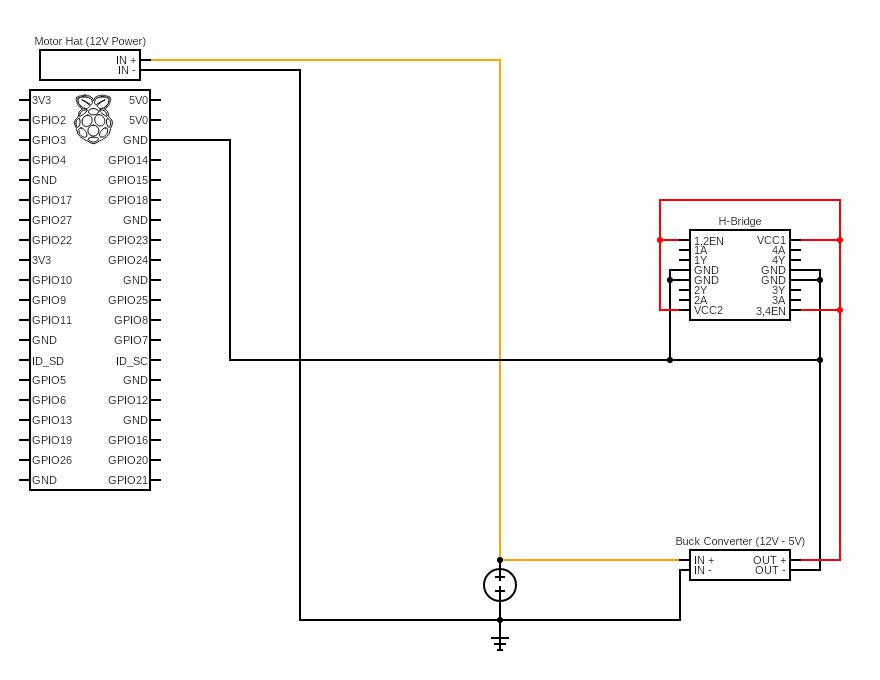

# Ideal Power Distribution Map

Since a lot of teams have had problems with damaging or completely burning their Raspberry Pi this semester, we've decided to put together an ideal power map for you all to reference to help mitigate some of the common issues and pitfalls when wiring power to everything for your Pi.

Most of the issues we've seen have come from the H-Bridge and Buck Converter connections, so we'll go over some of the pitfalls for those below.

In the above diagram, Orange signifies the positive 12V rail and Red signifies the Positive 5V rail. As you can seen from the diagram above, we have the 12V and 5V rails in ground isolation. This means that we keep a separate ground for the 12V rail and the 5V rail. This is to ensure our Buck Converter circuit is ground isolated, preventing [ground loops](https://en.wikipedia.org/wiki/Ground_loop_(electricity)). In this same vein, we'll also want to tie together the 5V rail ground from the Buck Converter and H-Bridge to the ground on our Pi. This ensures our GPIO signals have a common ground, reducing noise in the signal.

It is important to note that from the [datasheet](https://www.ti.com/lit/ds/symlink/sn754410.pdf), the ground rail on the H-Bridge is also meant to be used as a heat sink for the chip. As you have probably noticed by now, the H-Bridge gets quite hot in operation. In order to avoid sinking this heat directly into the ground plane of the Raspberry Pi, you and your team should attach this ground to some form of heat sink, such as a large nut/bolt, or a ready-made one from Amazon. Be careful not to short the 5V rail to your heat sink, as it is a connection to ground.