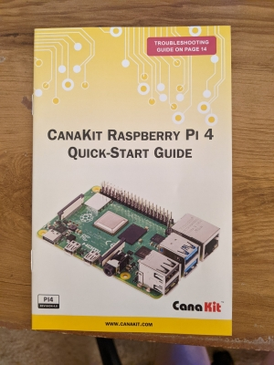
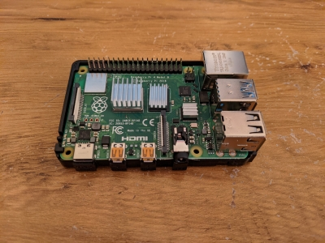
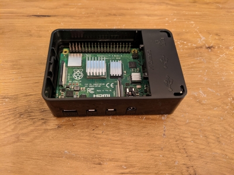
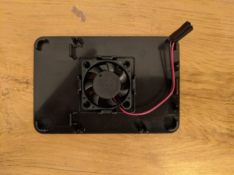
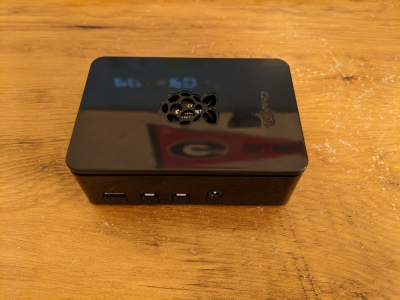
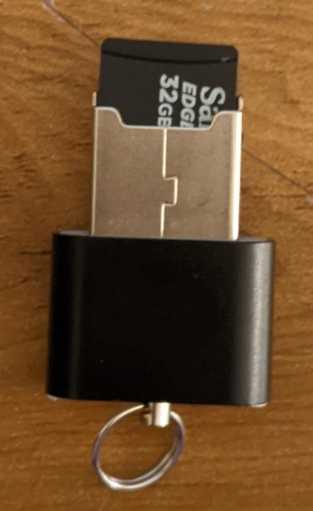
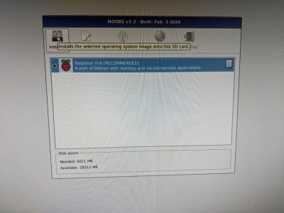
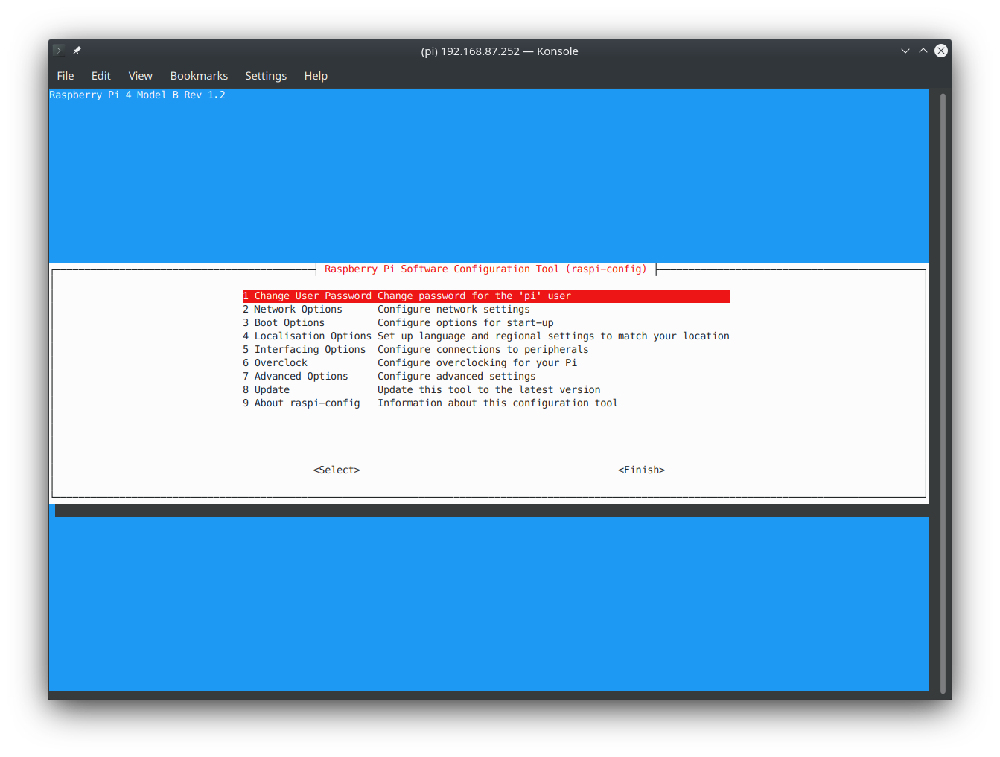

# Initial Setup

This section goes through the one-time setup students will need to perform upon receiving their kits.

## Hardware

The first thing we'll need to set up is our Raspberry Pi 4 hardware! Each group should have received a kit including the CanaKit Raspberry Pi 4 set, which includes a Raspberry Pi 4, a USB Type C power supply, and some assorted electronics/components we'll use later.

A lot of this information can also be found in the CanaKit Quickstart Guide pictured below, however it does not go into very much detail.



### Heat Sinks

Your kit should have included some heat sinks with it, this is to make sure we are not overheating some of the more sensitive Raspberry Pi 4 components when in use such as the CPU, the SDRAM, and the USB 3.0 controller. Below is an image of where these three heat sinks should go on the board.


### Case

In the future we'll make some modifications to this setup the make room for our various I/O breakout boards and hat, but for now we'll simply put the Pi into the included case as shown below:





At this stage, it would be wise to attach the small fan to the lid of the case as shown below (it's secured by plastic clips, so be careful), and then fit the lid to the top of the case.





## Software

Now, we'll go through the OS installation, and make sure our Python environment is correctly configured with all of the software dependencies you'll need for the project.

### Raspbian Installation

To install Raspbian, we'll need to boot up the Pi for first-time setup. If you don't have a keyboard, mouse, and monitor available to you for this first time setup, please refer to the 'Headless setup' section below, and if you do have access to them, refer to the 'Desktop setup' section.

#### Headless Setup

When doing a headless installation, you'll need to manually install Raspbian on the SD card that came with the Pi. When installing Raspbian directly on the SD card, you'll need to do a simple step to enable SSH before booting up your Pi and logging in. This ensures that you can access with Pi without ever having to connect it to a keyboard/mouse/monitor.

To begin, insert the microSD card into the included USB adapter by simply sliding it all the way into the upper portion of the adapter as shown below:



Then, insert it into on of your computers USB ports.

From here, you'll need to follow the directions for your operating system under the 'Using other Tools' section of [this guide by the Raspberry Pi foundation](https://www.raspberrypi.org/documentation/installation/installing-images/).

> Note: DO NOT USE the Raspberry Pi Imager software at the top of the page. In our experience it is not as reliable as the individual solutions for each operating system.
> Also Note: When choosing the Raspbian version to download [here](https://www.raspberrypi.org/software/operating-systems/), ***make sure to download Raspberry Pi OS Lite***, as this ensure you'll be able to configure Networking and SSH before booting the Pi itself.

When your SD card is done imaging, open up the `boot` partition of the SD card and create an empty file named `ssh` with no file extension. This will enable SSH on boot for the Raspberry Pi. Also, You'll need to set up some networking settings by creating a file named `wpa_supplicant.conf` in the same directory and pasting the following into it:

```
ctrl_interface=DIR=/var/run/wpa_supplicant GROUP=netdev
update_config=1
country=US
```

If you want to use a home WiFi network to work on the Pi (Not PAWS-Secure, or any other community internet), you'll also need to add the following lines at the bottom of the file:
```
network={
     ssid="«your_SSID»"
     psk="«your_PSK»"
     key_mgmt=WPA-PSK
}
```

With «your_SSID» replaced by your home network name, and «your_PSK» replaced by the password.

If you don't have access to a home WiFi network, you'll need to use an ethernet bridge to share your WiFi connection from your computer to the Pi. To set one up, go through the [Networking](#networking) section below.

When you've done that, you're good to insert the microSD card into its slot on the Pi and power it with the USB-C adapter! The Pi will boot right into Raspbian with SSH enabled so that you can continue doing the setup without a keyboard/mouse/monitor. 

To continue setup, connect to the Pi via SSH by following the [SSH section below](#ssh-and-vnc-viewer).

If you think you would like to use VNC Viewer to work on the Pi, or if you plan on being able to use the Pi with a monitor in the future, you'll need to install the Raspbian Desktop Environment now. To do so, you can [follow this guide](https://raspberrytips.com/upgrade-raspbian-lite-to-desktop/), making sure to use the PIXEL desktop environment, as it's the most optimized for the Raspberry Pi, reducing the performance impacts felt by your plotter program!

#### Desktop setup

First, make sure the included microSD card is in its slot as show below:


Then, use the miniHDMI to HDMI adapter to connect the Pi to a monitor, and connect a mouse and keyboard as well, you'll need it. Finally, plug in the USB Type C power supply, which will power on the Pi.

The included microSD card comes installed with a OS installation utility called NOOBS, which comes pre-configured with an image of Raspbian OS, a debian-based distribution of Linux built specifically for the Raspberry Pi. When you boot up the Pi for the first time, you'll be greeted by the following splash screen:



Go ahead and check the box next to the Raspbian OS option, and click install to begin the installation process. A warning will come up, just hit yes on the dialogue box.


After Raspbian is installed, the Pi should reboot into initial setup for the Operating System, this process is pretty straight forward, just follow the on-screen instructions, and make a note of the username and password for the Pi, we'll need this information fairly often. Note: skip the WiFi and update sections for now, we'll set up the networking in the next section.

After setup, Raspbian will prompt a restart, go ahead and do this.

### Raspbian Configuration

Now that you've got Raspbian installed, we need to do a bit of configuration to enable all of the settings we need.

On the Pi desktop (or in an SSH terminal), open a terminal window from the task bar, it should look something like this:


Then, run the `raspi-config` command to configure some settings on the Pi:

```
sudo raspi-config
```

It should bring up a dialogue window that looks similar to this:



From here, we need to change a few settings: 

1. Go into Boot Options -> Desktop / CLI and select the last option, `Desktop Autologin`
2. Go into Interfacing Options and enable: `SSH`, `VNC`, `SPI`, and `I2C`
3. Finally, go into Advanced Options -> Resolution and select the highest possible resolution (1920x1080 @ 60Hz 16:9)

After changing these settings, go ahead and reboot the Pi. You can do this from the command line with:

```
sudo reboot
```

Now you *should* be ready to move on!

### Networking

To successfully connect the Raspberry Pi to the internet we have a few options. We could connect it directly to a network with the built-in ethernet and WiFi adapters, however if your WiFi network is configured incorrectly (accidentally or on purpose, thanks Spectrum) or if you try to connect to the PAWS-Secure network on campus you'll quickly run into issues. 

To remedy this, we suggest setting up an Ethernet Bridge between your computer (one with WiFi capability) and the Raspberry Pi, which will share your computer's internet connection with it! Setting these up is fairly straight forward, and we've provided guides for a few Operating Systems below.

#### [Windows](https://communities.efi.com/s/article/How-to-bridge-WiFi-with-Ethernet-in-Windows-10?language=en_US)

#### [MacOS](https://support.apple.com/guide/mac-help/bridge-virtual-network-interfaces-on-mac-mh43557/mac)

#### [Linux](https://www.raspberrypi.org/forums/viewtopic.php?t=13211) (If you use something other than Ubuntu, you're on your own)

Once you have the bridge setup, simply connect an ethernet cable to both your computer and your 

Of course, if you would like, you can use WiFi to connect to your Raspberry Pi by using the networking menu on the Raspberry Pi desktop or by following [these command-line instructions](https://www.raspberrypi.org/documentation/configuration/wireless/wireless-cli.md).

### SSH and VNC Viewer

Now that you've got your Pi connected to the internet through your computer, we can use and access it without a monitor using a couple of tools: SSH and VNC Viewer. 

SSH is protocol used to connect to and use remote devices using a Command-Line Interface. It is secure, and an industry standard in remote work, server administration, and much more.

VNC is also a protocol used to connect to and control remote devices, however instead of using the command-line, VNC allows the user to view the desktop of the remote device, and control it graphically.

To use these two technologies, you'll need a compatible client for you computer. For VNC, you'll be using the popular [VNC Viewer](https://www.realvnc.com/en/connect/download/viewer/). To use SSH on Windows you'll need an SSH client such as [MobaXterm](https://mobaxterm.mobatek.net/), while for MacOS and Linux you can simply use your system's terminal with `ssh` command as follows:

```
ssh pi@[IP Address of Pi]
```

When prompted for a password, the default password for the Pi is "raspberry".

To use either of these tools, you'll need the IP address of the Raspberry Pi on the network (presumably over the ethernet bridge we set up earlier). Luckily, the [Raspberry Pi Foundation has compiled a guide](https://www.raspberrypi.org/documentation/remote-access/ip-address.md) for how to do this. 

> Note: If you're using the ethernet bridge setup, you'll need to use nmap with the `broadcast` IP address for your ethernet port. [here is a quick guide](https://documentation.progress.com/output/ua/OpenEdge_latest/index.html#page/gsins/determining-the-broadcast-address.html) to finding it on Unix (MacOS/Linux) and on Windows.

No matter which option you choose, we will be using the Command-Line frequently in setup and some of our other tutorials, so its worth the effort to get familiar with the interface. A great guide for learning Linux Command-Line can be found [here](https://linuxcommand.org/lc3_learning_the_shell.php).

### System Dependencies

After we have the Pi connected to the internet, we can start installing some of the system dependencies we'll need for this project. System dependencies are simply programs or piece of code we need to be able to write and run our software.

First, we'll make sure we have an up-to-date system by running these two command consecutively:
```
sudo apt update
sudo apt upgrade
```

Then we need to install the dependencies using these commands:
```
sudo apt install pigpio python-pigpio python3-pigpio git
```
It will be helpful to start the `pigpio` daemon at start up. To do this, run the following command.

```
sudo systemctl enable pigpiod
```

### Python Environment and Dependencies

Now that we have the Pi connected to the internet, and can connect with/interact with it without having to have peripherals connected, we can start setting up our programming environment for this project. You'll be using Python to program your XY Plotter as its easy to pick up and has very good packages for using the hardware we have.

To make dealing with dependencies less of a headache, we'll be using a [Python Virtual Environment](https://realpython.com/python-virtual-environments-a-primer/), which confines all packages installed to that environment, making it easier to work on multiple projects (which may need different versions of the same package) on the same computer.

With that being said, let's jump right into it by opening up a terminal on the Pi in your preferred way (SSH/VNC or keyboard/mouse/monitor).

First, we'll need to install `pip`, the Python package manager, which will allow us to install the Python modules we need for this project.
```
sudo apt install python3-pip
```

When the installation completes, check that it installed correctly by running:
```
pip3 --version
```

After that, we'll use `pip` to install `virtualenv` and `virtualenvwrapper`:
```
sudo pip3 install virtualenv virtualenvwrapper
```

Then we'll set up our terminal environment to use `virtualenv` with these commands:
```
echo -e "\n# virtualenv and virtualenvwrapper" >> ~/.bashrc
echo "export WORKON_HOME=$HOME/.virtualenvs" >> ~/.bashrc
echo "export VIRTUALENVWRAPPER_PYTHON=/usr/bin/python3" >> ~/.bashrc
echo "source /usr/local/bin/virtualenvwrapper.sh" >> ~/.bashrc
```
and Finally:
```
source ~/.bashrc
```

Now we can create our new virtual environment, you can name it whatever you like, just make sure you can remember it, we'll use the name 'plotter':
```
mkvirtualenv plotter -p python3
```

Then we can use the `workon` command to change into our newly create virtual environment:
```
workon plotter
```

Now that we're in our virtual environment, you should see `(plotter)` on the left of your terminal prompt. Install the follow Python dependencies with `pip`:
```
pip3 install RPI.GPIO
pip3 install adafruit-blinka
pip3 install adafruit-circuitpython-motorkit
pip3 install wiringpi
pip3 install pigpio
pip3 install pigpio_encoder
```

Now that we have our Python dependencies in order, we can leave the virtual environment using the command:
```
deactivate
```

### Setting up Git

Git is an industry standard version control system, which is extremely useful for managing and working on software projects. Here is a [great guide for setting up git with a Github account](https://docs.github.com/en/free-pro-team@latest/github/getting-started-with-github/set-up-git). You should use SSH to clone and commit to repositories, and only ONE team member should connect their Github account with the Raspberry Pi git configuration.

Note: You'll have to install and setup git on every device you intend to work on, this includes generating SSH Keys, and adding them to the account.

Congratulations! Your Pi should have everything it needs to run your project!

## Next Steps

Now that you have your Pi set up, you can move on to [Working on the Pi](working_on_pi.md).
