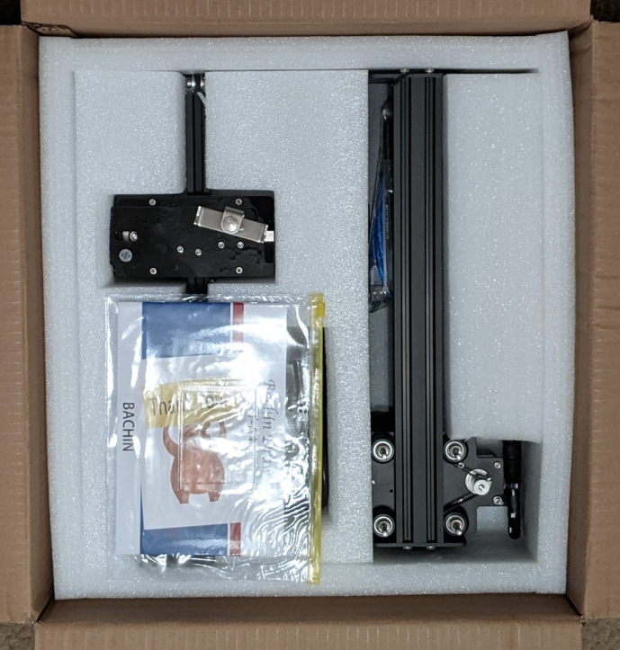
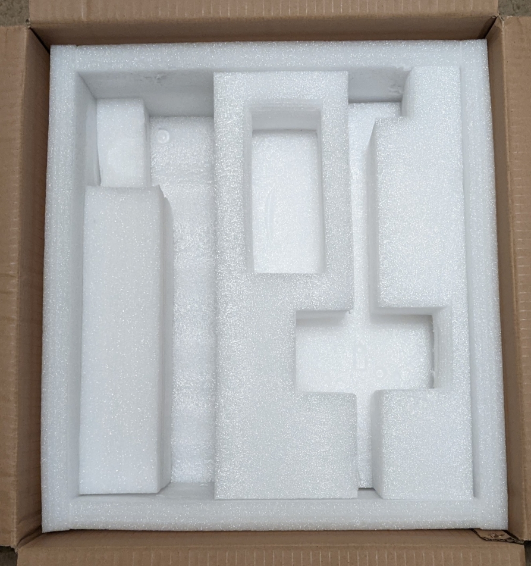
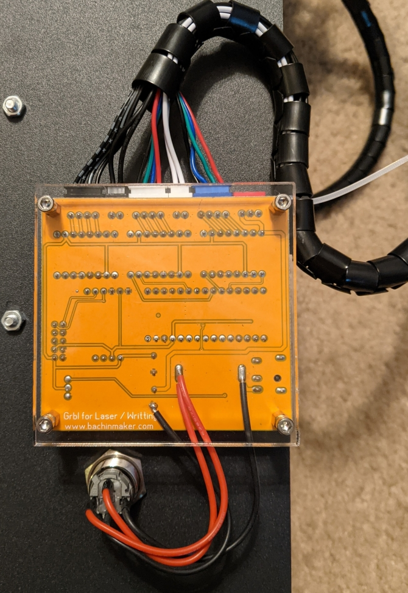
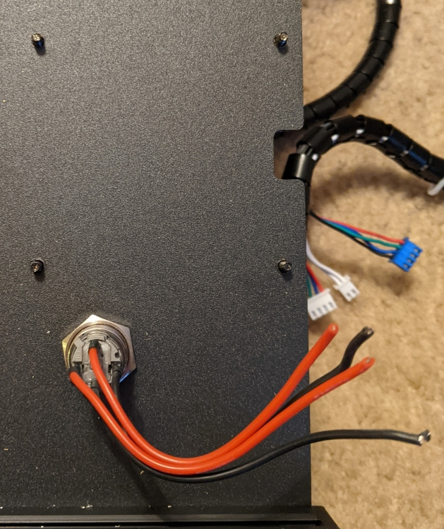

# Plotter Setup

In this document, students will assemble and use the existing XY Plotter provided, and modify it for use with the Raspberry Pi and its hardware (excluding the 350mA stepper motors).

## Documenting Existing Behavior

When you open up the box for your plotter, you should be greeted by something like this:

The plotter comes with the assembly itself in two pieces, a power supply, small toolkit/hardware, and a helpful quick start guide. Begin by removing the contents of the package:

Save this box and the styrofoam inserts, as it keeps the plotter organized and safe if you need to transport it.

With everything out of the package, simply follow the included instructions in the user guide to set it up. You'll need to install a Windows utility to use the plotter, so make sure to do that.

When you have the plotter assembled and the Windows Utility up and running, simply take a video of each axis moving, and use that for your submissions. After you finish, uninstall the utility from your computer.

## Modifying the Plotter for use with the Pi

In this document, we'll make some modifications to the plotter hardware so we can use it with the Raspberry Pi and it's accompanying hats. T

While you're disassembling/modifying the plotter, you'll need the included allen wrenches that came with it, a pair of pliers, and some scissors/wirecutters. Make sure to save the parts/hardware you remove, and keep it organized.

for this section, we need to disconnect the existing control hardware, leaving the power switch and pre-routed cables intact. Flip over the plotter assembly and you should see a control board much like the one pictured below:

First, disconnect the wiring harness from all of the hardware including the motors, making sure to leave the limit switches intact. Then remove the plexiglass using the second largest allen wrench in the kit, and use the pliers to remove the standoffs and the board (save the smaller standoffs for later, we'll need them). In order to save the power switch, snip the wires as close to the board as possible. When you're done, the bottom of the plotter should look like this:

