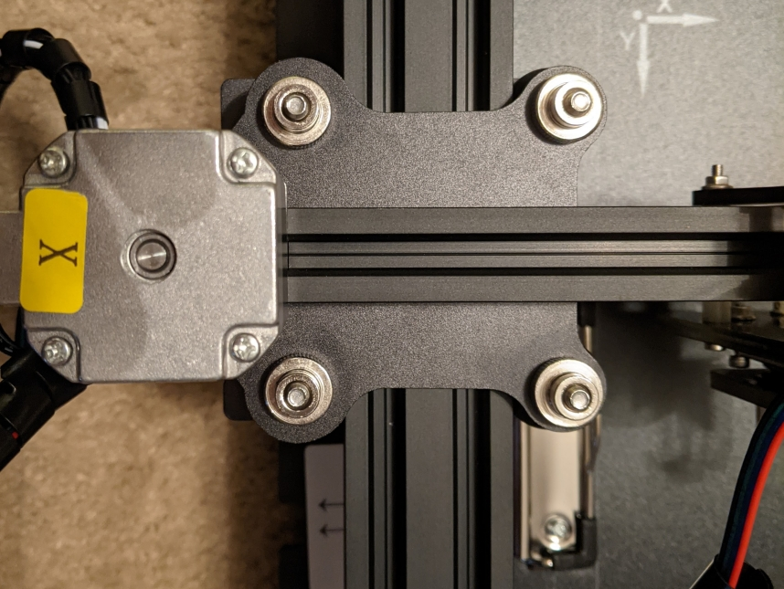
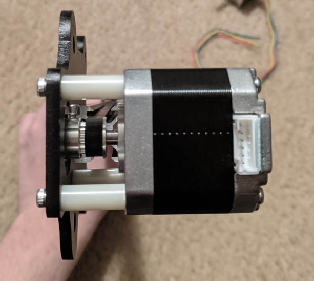
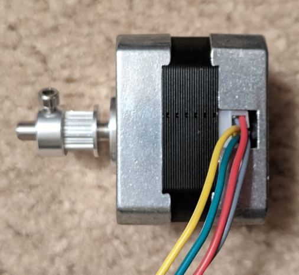
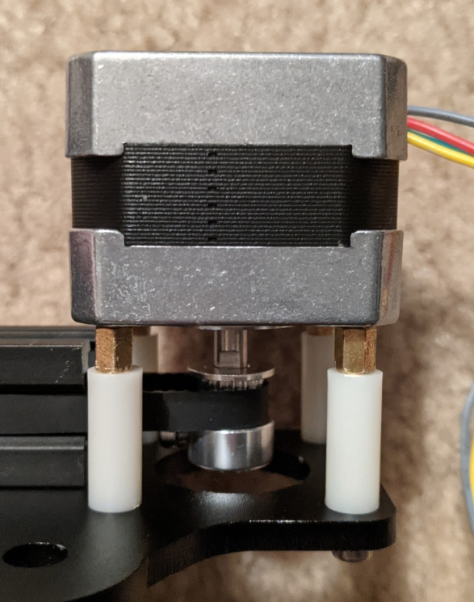
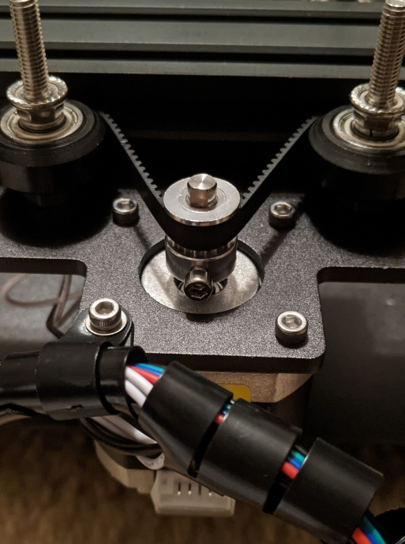
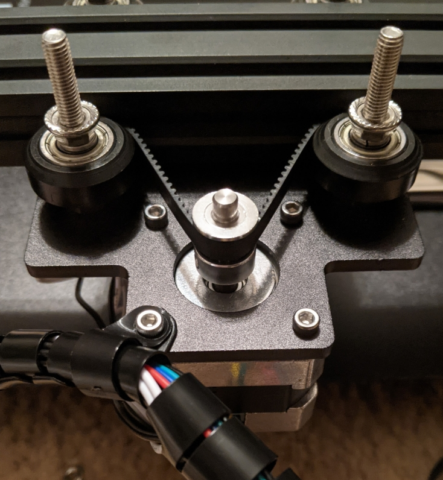
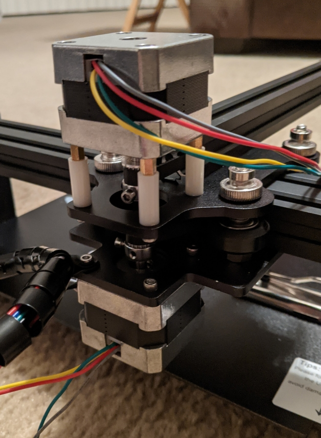

# Replacing the X and Y Stepper Motors

In this document, we'll replace the X and Y axis stepper motors with the new 12V 350mA stepper motors needed to use the Adafruit Motor Hat.h Te stepper motors that come with the plotter draw 1.6A concurrently at 12V, which the drivers on the Adafruit Hat ***cannot*** supply. Therefore, we have also provided you with two new 12V stepper motors that draw up to 350mA concurrently which you'll need to affix to the plotter chassis.

First, we'll replace the X-axis motor. Begin by removing the X/Z gantry from the Y gantry, secured by the four thumb screws shown below:

When you've got it removed, take note of how the X-axis motor is mounted, we'll be mounting the new motor in almost the exact same way: 

Begin disassembly be loosening the toothed belt pulley and the mounting screws for the motor, when you have the motor separated from the belt pulley and the gantry, position the belt pulley loosely onto the new motor as below, paying careful attention to the orientation:

Next, take the smaller brass standoffs from the board mount, and screw them into the mounts on the new motor, this will solve a mounting problem caused by the new motors. After that, mount the new motor in the same way as the old, making sure to loop the belt around the pulley before securing the new motor. When you have the first two screws set, adjust the position of the belt pulley so that no snag or other friction occurs. When done, it should look something like this:

Now we'll replace the Y-axis motor in a simpler process. Loosen the belt pulley and the mounting screws, making sure the keep the cable sleeve intact. Again, take note of the orientation and the position of the belt pulley on the motor shaft:

Similarly to how we mounted X-axis motor, make sure to wrap the belt around the pulley, secure the first two mounting screws, and adjust the pulley height such that the belt is level with the guide pulleys. Also make sure to replace the cable sleeve as it was before:

Now remount the X/Z gantry, making sure there are no conflicts/snags between the X and Y-axis motors:

After that, you're mechanical modifications are done! We recommend creating new connectors (female molex connectors) for the steppers so that you can use the existing wiring harness and generally keep your connections clean and solid.