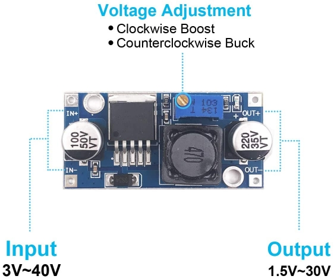

# Using the Buck Converter

Since many of you encountered issues with the linear regulator, we have purchased and handed out some buck converter modules for you all to use as a replacement. We bought them from [Amazon](https://www.amazon.com/gp/product/B07VVXF7YX/ref=ppx_yo_dt_b_asin_title_o01_s00?ie=UTF8&psc=1), and they can output 3A from 1.25V - 30V. 

From the picture below, you'll want to put some jumper pins onto the Input+/- and Output+/- as directly soldering wires onto a board like this could cause issues in the future. After that, connect leads from your 12V power supply to the Input+/- pin and connect a voltmeter (or multimeter in voltage mode) to the Output+/- pins. With your 12V power supply on, adjust the output voltage to 5V by turning the voltage adjustment screw on the module clockwise to increase the output voltage and counter-clockwise to decrease the output voltage.

When you have adjusted the module to output 5V, you can then use it in place of your linear regulator for your H-Bridge circuit.