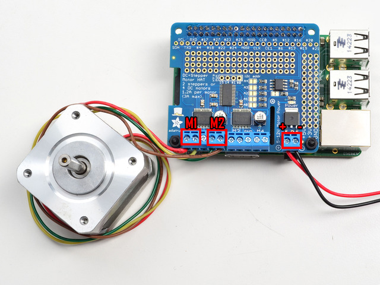
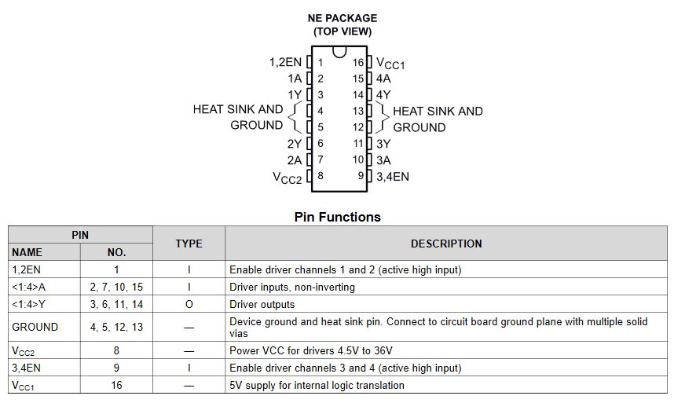
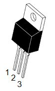

# Motor Hat and Stepper Motors

## X & Y Axis Stepper Motors

The supplied motors for the XY Plotter draw too much current for our Motor Hat. We will replace them with lighter-weight motors.

### Hardware Setup

First determine which wires are connected to each coil in the stepper motor. There are two coils each with a pair of wires. To find the pairs, first spin the motor shaft by hand to get a feel for the resistance. Then pick a pair of wires and touch their leads together and spin the motor shaft. If there is a slight increase in resistance, then those two wires are a pair. If no change, test another pair of wires until your find the sets. Attach one pair to the `M1` terminals, leave the middle terminal open, and attach the second pair to `M2`.

To power the motor hat, we will use the provided 12V power supply. A female barrel jack supplied in your kit needs to be attached to the power terminal of the hat. Attach a wire from the positive end of the barrel jack to the positive terminal on the hat, do the same for the negative side.

### Software Setup

The controller (in this case, Raspberry Pi) must tick each of the coils in order to make the motor move. Each two 'ticks' is a step. By alternating the coils, the stepper motor will spin all the way around. If the coils are fired in the opposite order, it will spin the other way around.

There are four essential types of steps you can use with your Motor HAT. 
1. **Single Steps** - this is the simplest type of stepping, and uses the least power. It uses a single coil to 'hold' the motor in place.
2. **Double Steps** - this is also fairly simple, except instead of a single coil, it has two coils on at once. For example, instead of just coil #1 on, you would have coil #1 and #2 on at once. This uses more power (approx 2x) but is stronger than single stepping (by maybe 25%)
3. **Interleaved Steps** - this is a mix of Single and Double stepping, where we use single steps interleaved with double. It has a little more strength than single stepping, and about 50% more power. What's nice about this style is that it makes your motor appear to have 2x as many steps, for a smoother transition between steps
4. **Microstepping** - this is where we use a mix of single stepping with PWM to slowly transition between steps. It's slower than single stepping but has much higher precision. We recommend 8 microstepping which multiplies the # of steps your stepper motor has by 8.

The motor hat can control two stepper motors and are available as `stepper1` and `stepper2`. `stepper1` is the motor connected to `M1` and `M2` terminals, `stepper2` is the motor connected to the `M3` and `M4` terminals. 

The stepper library from Adafruit provides the following options:

* `direction`, which should be one of the following constant values:
  * `stepper.FORWARD` (default)
  * `stepper.BACKWARD`
* `style`, which should be one of the values:
  * `stepper.SINGLE` (default) for a full step rotation to a position where one single coil is powered
  * `stepper.DOUBLE` for a full step rotation to position where two coils are powered providing more torque
  * `stepper.INTERLEAVE` for a half step rotation interleaving single and double coil positions and torque
  * `stepper.MICROSTEP` for a microstep rotation to a position where two coils are partially active
* `release()` which releases all the coils so the motor can free spin, and also won't use any power

The function returns the current step 'position' in microsteps which can be used to understand how far the stepper has moved.

To see their use in action, create a new Python file (`stepper_test.py`) and copy in the following code:

    """Simple test for using adafruit_motorkit with a stepper motor"""
    import time
    import board
    from adafruit_motorkit import MotorKit

    kit = MotorKit(i2c=board.I2C(),address=0x61)

    for i in range(100):
        kit.stepper1.onestep(direction=stepper.BACKWARD, style=stepper.DOUBLE)
        time.sleep(0.01)

Try to run your code

    $python stepper_test.py

## Z Axis Stepper and H-Driver
To control the stepper for the Z-axis (pen holder), we will use a SN754410 Quadruple Half-H Driver. This IC can provide drive currents up to 1 A at voltages betweetn 4.5 V to 36 V. [Datasheet](https://www.ti.com/lit/ds/symlink/sn754410.pdf)

The Z-axis stepper is a 5-volt motor but our power supply provides 12 volts. To step down the voltage we will use a voltage regulator. This device is simple to use with only 3 pins. 

Pin 1 : Input  
Pin 2 : Ground  
Pin 3 : Output

 
