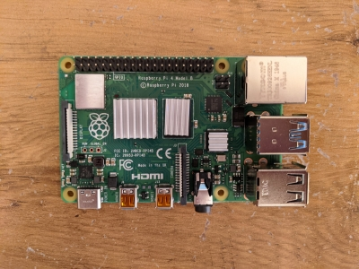
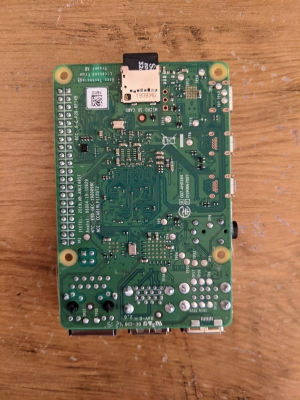
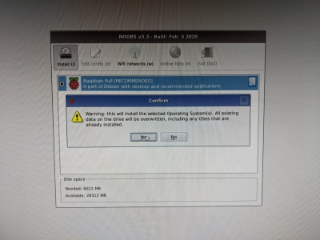

# Initial Setup

This section goes through the one-time setup student will need to perform upon recieving their kits.

## Hardware

The first thing we'll need to set up is our Raspberry Pi 4 hardware! Each group should have recieved a kit including the CanaKit Raspberry Pi 4 set, which includes a Raspberry Pi 4, a USB Type C power supply, and some assorted electronics/components we'll use later.

A lot of this information can also be found in the CanaKit Quickstart Guide pictured below, however it does not go into very much detail.

### Heat Sinks

Your kit should have included some heat sinks with it, this is to make sure we are not overheating some of the more sensitive Raspberry Pi 4 components when in use such as the CPU, the SDRAM, and the USB 3.0 controller. Below is an image of where these three heat sinks should go on the board.

### Case

In the future we'll make some modifications to this setup the make room for our various I/O breakout boards and hat, but for now we'll simply put the Pi into the included case as shown below:

At this stage, it would be wise to attach the small fan to the lid of the case as shown below (it's secured by plastic clips, so be careful), and then fit the lid to the top of the case.

### Bootup

Before we can start digging into the software setup, we'll need to boot up the Pi with a mouse, keyboard, and monitor attached for first-time setup. First, make sure the included microSD card is in its slot as show below:

Then, use the miniHDMI to HDMI adapter to connect the Pi to a monitor, and connect a mouse and keyboard as well, you'll need it. Finally, plug in the USB Type C power supply, which will power on the Pi.

## Software

Now, we'll go through the OS installation, and make sure our Python environment is correctly configured with all of the software dependancies you'll need for the project.

### Rasbian Installation

The included microSD card comes installed with a OS installation utility called NOOBS, which comes pre-configured with an image of Rasbian OS, a debian-based distribution of Linux built specifcally for the Raspberry Pi. When you boot up the Pi for the first time, you'll be greeted by the following splash screen:

Go ahead and check the box next to the Rasbian OS option, and click install to begin the installation process. A warning will come up, just hit yes on the dialogue box.

After Rasbian is installed, the Pi should reboot into initial setup for the Operating System, this process is pretty straight forward, just follow the on-screen instructions, and make a note of the username and password for the Pi, we'll need this information fairly often. Note: skip the WiFi and update sections for now, we'll set up the networking in the next section.

After setup, Rasbian will prompt a restart, go ahead and do this.

### Networking and SSH through an Ethernet Bridge

### Python Environment and Dependancies

