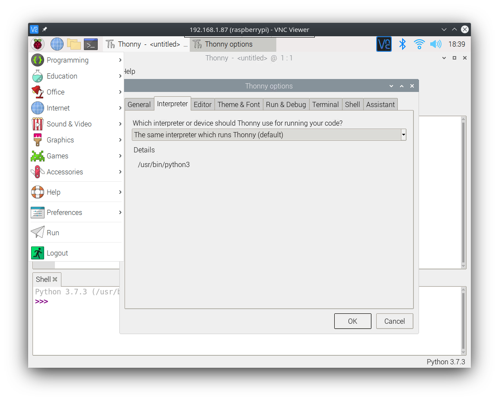
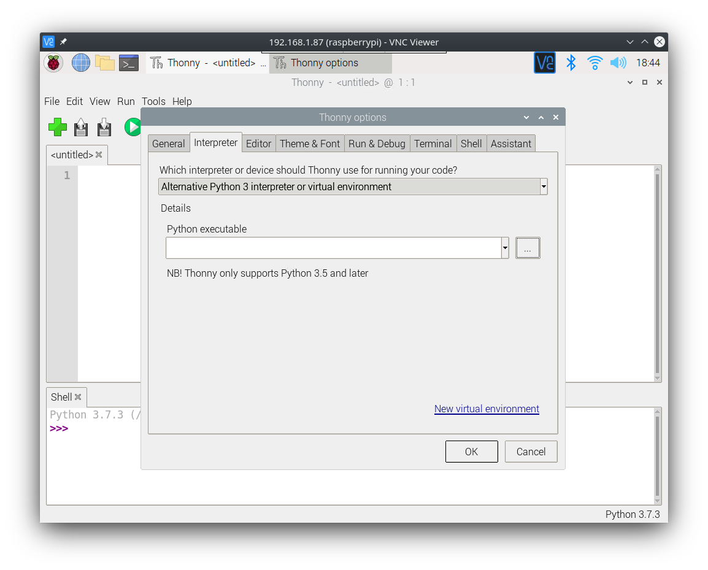

# Working on the Pi

When working on this project, you have a couple of options for how you want to make changes to your code or generally work on the Raspberry Pi:

1. Working directly on the Pi using SSH/VNC
2. Working on your personal computer, and pushing changes to the Pi using Git

In either case, you should regularly back up your work using Git and Github so you and your teammates can stay up to date on the progress of your project.

## Working Directly on the Pi (SSH/SSHFS, VNC, and MobaXterm)

When possible, you should prefer to work directly on your Raspberry Pi, as it will make prototyping and debugging your XY Plotter a bit faster and easier. We understand this is not always possible, but it is the preffered way to complete this project, as it allows your team to get real-time feedback for your software.

Below we've provided instructions for three methods of working directly on your Raspberry Pi, assuming your personal computer is connected on the same network (or via an Ethernet Bridge) as the Pi and that you have the IP Address of the Pi on the network.

### MobaXterm (Windows Only)

The best all-around solution for working on the Pi with a Windows computer is a program called [MobaXterm](https://mobaxterm.mobatek.net/). It supports a number of communication protocols including SSH and VNC, and it comes with a built-in remote file explorer which you can use to edit remote files with your favorite code editor on your personal computer. Most questions regarding how to use MobaXterm are answered within their [documentation](https://mobaxterm.mobatek.net/documentation.html) or with a quick google search.

In general, you'll be using an SSH terminal to execute commands and run your code on your Pi, and you'll be using the file explorer to edit your files/code on the device.

Setting up a custom editor for the remote file explorer is fairly simple, just open up the configuration menu and in the `General` tab you can edit the `Default text editor program` to point to the .exe file for your favorite text editor. We recommend [VS Code](https://code.visualstudio.com/) as it has tons of plugins for doing pretty much anything you need.

Of course for small edits, you can just use a command-line text editor on the Pi itself such as `nano`, `vim`, or `emacs`. 

### SSH/SSHFS (MacOS/Linux Only)

A good solution for working on the Pi with a MacOS or Linux computer is using the default SSH program in your terminal combined with the SSHFS program, which allows you to mount a remote file system to a directory on your computer. Much like with MobaXterm, you'll be using your SSH terminal to execute commands and code on the Pi, and you'll be editing your code with your favorite editor in the mounted directory.

Using SSH on MacOS/Linux is fairly simple, just open up a terminal and use this command format, replacing [IP of RPi] with the IP Address of your Raspberry Pi:
```
ssh pi@[IP of RPi]
```
A message pertaining to SSH key fingerprints will come up, just say yes, and then enter the password for your Pi. If you have a different user on the Pi (which we recommend against), you'll need to replace `pi` with whatever that username is.

While we recommend against it (MobaXterm is easier), you can use this method on Windows. You'll need an SSH client such as [MobaXterm](https://mobaxterm.mobatek.net/) or [PuTTY](https://www.putty.org/), and you can use the SSHFS program as detailed below.

A great guide to setting up SSHFS can be found [here](https://www.digitalocean.com/community/tutorials/how-to-use-sshfs-to-mount-remote-file-systems-over-ssh). This guide covers MacOS, Linux, and Windows.

Again for small edits, you can just use a command-line text editor on the Pi itself such as `nano`, `vim`, or `emacs`.

### VNC (All OS's)

If you have little experience with the command-line and need a more graphical interface while you get your bearings, then VNC is the program for you! VNC is a lightweight protocol used to stream the desktop of the Raspberry Pi to any computer connected on its network. VNC relies on a server-client model, and we've already enabled the VNC Server on the Raspberry Pi, so all we need is a client application to use it, called [VNC Viewer](https://www.realvnc.com/en/connect/download/viewer/).

To use VNC Viewer, just make sure your computer is connected on the same network as the Raspberry Pi, and enter its IP Address in the top bar. A dialog bog should pop up, just confirm and you should be connected to the Raspberry Pi desktop! From here you can use the terminal and a text editor to do your work on the Pi, or you could use the included Python IDE called [Thonny](https://thonny.org/) to edit your code.

### Setting up Thonny with Your Python Virtual Environment

If you're using VNC Viewer, and you want to use the built-in Python IDE Thonny, this section will cover how to use it with our previously configured (see [initial setup](./initial_setup.md)) Python virtual environment.

First open up Thonny on your Raspberry Pi and navigate to **Tools** -> **Options** and go to the **Interpreter** tab. If you can't see the **Tools** option, click on `switch to regular mode` and reboot Thonny:



Under the *Which interpreter or device should Thonny use for running your code?* option, select `Alternative Python 3 interpreter or virtual environment` and select the `...` next to the *Python Executable* field:



Then, in the file explorer, navigate to `/home/pi/.virtualenvs/plotter/bin/` and select the file `python3.7`. If you can't see the `.virtualenvs` directory in `/home/pi/` right-click on some empty space in the window and check the *show hidden files* box:


You should now be set up to work on your code in your created Python virtual environment!

## Working on Your Personal Computer (Git)

Working directly on the Raspberry Pi is not always possible, especially when workings in teams like you all are. To be more effective as a team and promote collaboration, you should use Git/Github when working remotely, away from the Raspberry Pi.

While you should have already set up Git on your Raspberry Pi, you should take some time now to set it up in your personal computer if you have not already. As linked previously [here is a guide](https://docs.github.com/en/free-pro-team@latest/github/getting-started-with-github/set-up-git) for setting up Git on your computer.

When you are done with that, you'll need to learn how to use Git properly, so that you can collaborate effectively with your peers. Knowing things like how to create branchs, merge changes, and rebase repositories is key to effectively collaborating with each other while avoiding common mistakes and frustrations (which only slow you down). [Github has compiled a fantastic set of guides](https://try.github.io/) for you all to follow.

In general if your team is working remotely with one member of your team in possession of the Pi/Plotter, you'll contribute code through Git (usually on your own branch to keep things tidy; one per team member), and the team member with the Pi will pull those changes and provide feedback/debugging information if necessary.